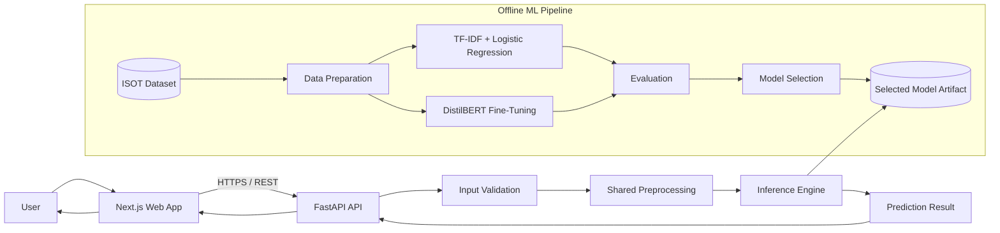
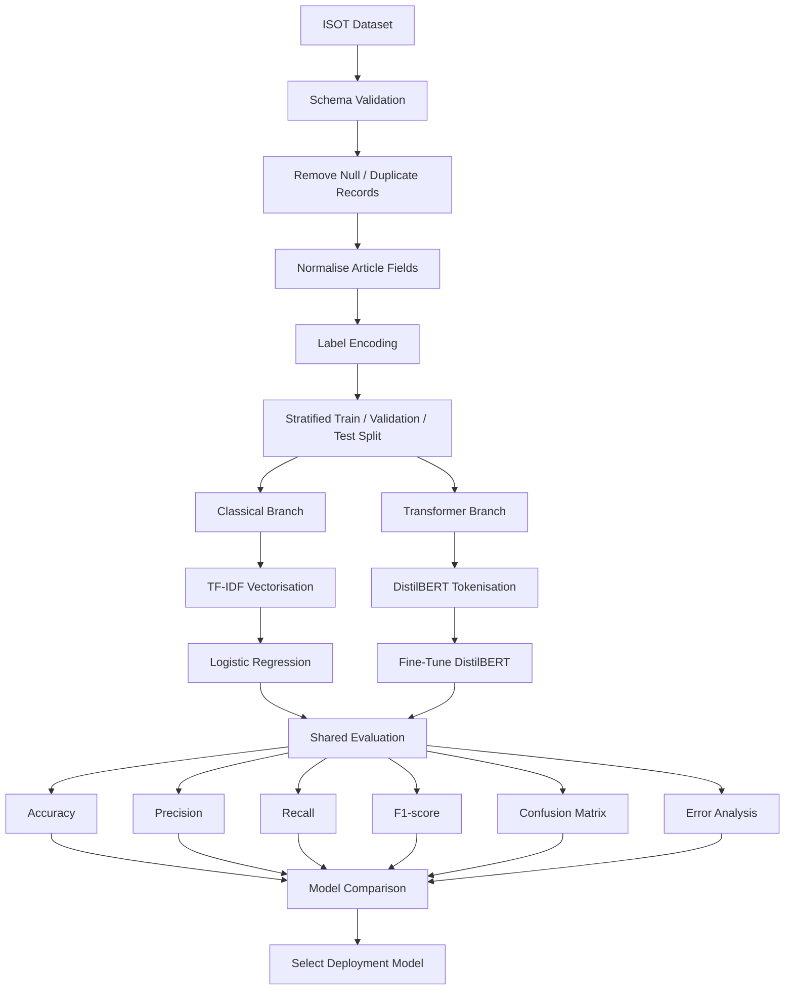
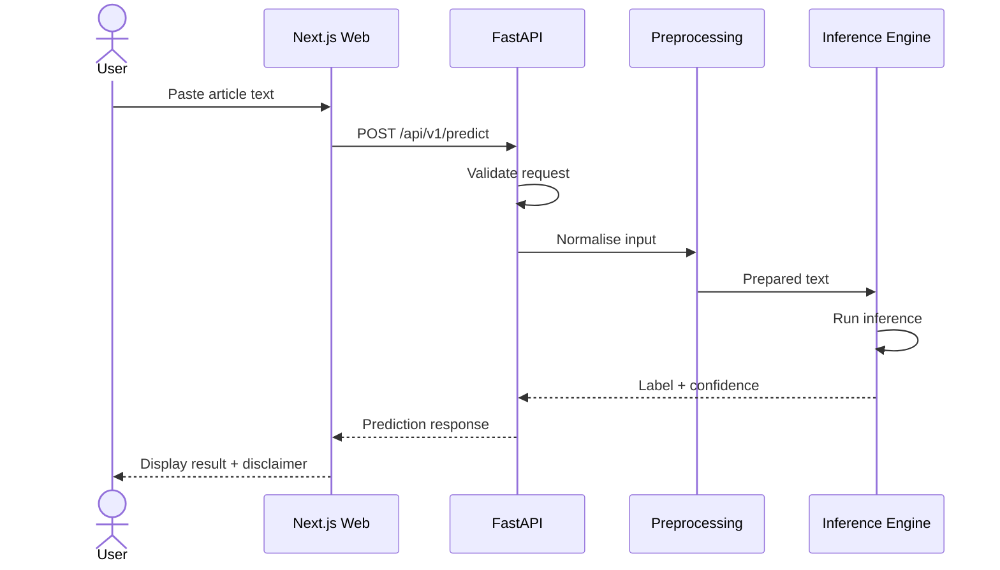

# VeriScope

**Automated Fake News Detection Using NLP and Transformer Models**

VeriScope is a full-stack fake news detection system that compares a classical machine learning baseline against a fine-tuned transformer model to classify news articles as **likely real** or **likely fake** from their textual content.

The project combines a **Next.js web application**, a **FastAPI backend**, and a modular **Python machine learning pipeline** for dataset preparation, model training, evaluation, and inference.

> **Important:** VeriScope is a machine learning decision-support system, not an independent fact-checking authority. Predictions should be interpreted as model estimates rather than definitive statements of truth.

---

## Table of Contents

- [Overview](#overview)
- [Problem Statement](#problem-statement)
- [Proposed Solution](#proposed-solution)
- [Objectives](#objectives)
- [Key Features](#key-features)
- [System Architecture](#system-architecture)
  - [High-Level Architecture](#high-level-architecture)
  - [Training Pipeline](#training-pipeline)
  - [Inference Flow](#inference-flow)
- [Dataset](#dataset)
- [Machine Learning Methodology](#machine-learning-methodology)
  - [Data Preparation](#data-preparation)
  - [Classical Baseline](#classical-baseline)
  - [Transformer Model](#transformer-model)
  - [Evaluation](#evaluation)
  - [Model Selection](#model-selection)
- [Technology Stack](#technology-stack)
- [Monorepo Structure](#monorepo-structure)
- [API Documentation](#api-documentation)
  - [Health Check](#1-health-check)
  - [Predict an Article](#2-predict-an-article)
  - [List Available Models](#3-list-available-models)
  - [Model Metrics](#4-model-metrics)
- [Web Application](#web-application)
- [Getting Started](#getting-started)
  - [Prerequisites](#prerequisites)
  - [Clone the Repository](#clone-the-repository)
  - [Configure Environment Variables](#configure-environment-variables)
  - [Install Backend and ML Dependencies](#install-backend-and-ml-dependencies)
  - [Install Frontend Dependencies](#install-frontend-dependencies)
  - [Prepare the Dataset](#prepare-the-dataset)
  - [Train the Classical Model](#train-the-classical-model)
  - [Train the Transformer Model](#train-the-transformer-model)
  - [Evaluate the Models](#evaluate-the-models)
  - [Run the API](#run-the-api)
  - [Run the Web Application](#run-the-web-application)
- [Testing](#testing)
- [Results](#results)
- [Reporting and Experiment Tracking](#reporting-and-experiment-tracking)
- [Limitations](#limitations)
- [Ethical Considerations](#ethical-considerations)
- [Security Considerations](#security-considerations)
- [Future Work](#future-work)
- [Documentation](#documentation)
- [Project Deliverables](#project-deliverables)
- [Author](#author)
- [License](#license)
- [References](#references)

---

## Overview

Online news and social media allow information to spread almost instantly. The same speed that improves access to information also makes misinformation difficult to control through manual fact-checking alone.

VeriScope investigates whether Natural Language Processing and machine learning can help automate part of this process by learning patterns associated with real and fake news articles.

The project intentionally compares two different modelling approaches:

1. **Classical machine learning**
   - TF-IDF feature extraction
   - Logistic Regression
   - Optional Linear Support Vector Machine benchmark

2. **Transformer-based classification**
   - DistilBERT as the primary transformer
   - Fine-tuning on the same article classification task

The best-performing validated model is exposed through a FastAPI inference service and consumed by a Next.js web application.

---

## Problem Statement

Manual fact-checking cannot keep pace with the volume and speed at which online misinformation is produced and distributed.

A software system capable of automatically analysing article text and estimating whether it resembles credible or fabricated news could assist researchers, readers, moderators, and media-monitoring teams.

The core research question is:

> **Can a machine learning system distinguish between real and fake news articles using only their textual content, and how does a classical TF-IDF model compare with a fine-tuned transformer model on the same task?**

---

## Proposed Solution

VeriScope provides an end-to-end pipeline for:

- ingesting a labelled fake news dataset;
- cleaning and validating article text;
- producing train, validation, and test splits;
- training a classical TF-IDF classifier;
- fine-tuning a transformer model;
- comparing both approaches using the same evaluation framework;
- selecting a validated model for inference;
- serving predictions through a FastAPI REST API; and
- presenting predictions through a modern Next.js web interface.

A prediction contains more than a binary label. The application can return:

- predicted class;
- confidence score;
- model used;
- model version;
- processing time; and
- a clear disclaimer explaining that the result is probabilistic.

---

## Objectives

The project aims to:

- collect and preprocess a labelled dataset of real and fake news articles;
- build a reproducible text preprocessing pipeline;
- implement a TF-IDF-based classical machine learning baseline;
- fine-tune DistilBERT for binary news classification;
- evaluate both approaches using accuracy, precision, recall, F1-score, and confusion matrices;
- analyse false positives and false negatives;
- compare model performance, complexity, latency, and deployment requirements;
- expose the selected model through a documented REST API;
- build a responsive web interface for article classification;
- implement automated tests for preprocessing, API behaviour, inference, and model utilities; and
- document technical limitations, ethical risks, and appropriate use cases.

---

## Key Features

### User-facing

- Paste article text for analysis.
- Receive a **Likely Real** or **Likely Fake** classification.
- View model confidence.
- See which model version produced the prediction.
- Display a responsible-use disclaimer.
- Handle invalid, empty, or excessively short inputs gracefully.
- Responsive desktop and mobile interface.

### Machine learning

- Reproducible ISOT dataset pipeline.
- Train/validation/test splitting.
- TF-IDF vectorisation.
- Logistic Regression baseline.
- Optional Linear SVM comparison.
- DistilBERT fine-tuning.
- Shared evaluation utilities.
- Confusion matrix generation.
- Error analysis.
- Model comparison reports.
- Exportable production model artifacts.

### Engineering

- Next.js frontend.
- FastAPI REST API.
- Pydantic request/response validation.
- Unified Python environment managed with `uv`.
- Modular ML code without unnecessary independent Python packages.
- Centralised automated tests.
- Environment-based configuration.
- API documentation through OpenAPI/Swagger.
- Clear separation between training and inference.

---

# System Architecture

## High-Level Architecture



The application separates **offline model development** from **online inference**.

Training is performed independently of the production API. Only validated model artifacts are loaded by the inference service.

---

## Training Pipeline



---

## Inference Flow



---

# Dataset

## Primary Dataset: ISOT Fake News Dataset

VeriScope uses the **ISOT Fake News Dataset** as its primary dataset.

The dataset is selected instead of LIAR because the primary application workflow classifies **news articles**, while LIAR is centred mainly on short claims and statements.

The ISOT dataset contains approximately **45,000 labelled real and fake news articles**, making it better aligned with the system's intended input format.

### Expected local layout

```text
datasets/
└── raw/
    └── isot/
        ├── Fake.csv
        └── True.csv
```

Processed data is generated locally:

```text
datasets/
├── raw/
├── processed/
└── splits/
```

Large datasets should not be committed directly to Git.

### Dataset policy

The data pipeline should:

1. load the original `Fake.csv` and `True.csv` files;
2. assign binary labels;
3. align column names;
4. combine the datasets;
5. remove duplicates and invalid records;
6. create the text field used for classification;
7. generate reproducible stratified splits; and
8. save processed metadata required for experiments.

---

# Machine Learning Methodology

## Data Preparation

The preprocessing strategy differs slightly between the classical and transformer models.

### Shared preparation

Shared steps may include:

- schema validation;
- null-value handling;
- duplicate removal;
- label encoding;
- whitespace normalisation;
- article-length checks;
- train/validation/test splitting; and
- reproducible random seeds.

### Classical preprocessing

The classical model can use:

- lowercasing;
- punctuation normalisation;
- optional stopword removal;
- optional lemmatisation;
- unigram and bigram features; and
- TF-IDF vectorisation.

Over-aggressive text cleaning should be avoided when it removes useful linguistic signals.

### Transformer preprocessing

DistilBERT receives substantially less manual linguistic preprocessing.

The pipeline primarily performs:

- basic text validation;
- whitespace normalisation;
- Hugging Face tokenizer processing;
- truncation;
- padding; and
- attention-mask generation.

---

## Classical Baseline

The primary classical baseline is:

```text
Article Text
    ↓
TF-IDF
    ↓
Logistic Regression
    ↓
Probability / Decision Score
    ↓
Likely Real / Likely Fake
```

Logistic Regression is used because it provides:

- a strong baseline for sparse text classification;
- comparatively low training cost;
- fast CPU inference;
- interpretable coefficients; and
- class probabilities.

A Linear SVM may also be evaluated as an additional classical benchmark.

---

## Transformer Model

The primary transformer model is **DistilBERT**.

```text
Article Text
    ↓
DistilBERT Tokenizer
    ↓
Token IDs + Attention Mask
    ↓
Fine-Tuned DistilBERT
    ↓
Classification Head
    ↓
Likely Real / Likely Fake
```

DistilBERT is preferred as the initial transformer because it provides a useful balance between contextual language representation, training cost, model size, and inference requirements.

The architecture can later support another compatible transformer without changing the public API.

---

## Evaluation

All candidate models are evaluated on the same held-out test data.

### Primary metrics

- Accuracy
- Precision
- Recall
- F1-score
- Confusion matrix

### Additional analysis

The evaluation module should also examine:

- false positives;
- false negatives;
- per-class metrics;
- inference latency;
- model artifact size;
- training time;
- prediction confidence distribution; and
- representative misclassified examples.

### Why error analysis matters

A fake news detection system has asymmetric risks.

A **false positive** may incorrectly label credible content as fake.

A **false negative** may allow fabricated content to appear credible.

For that reason, selecting a deployment model should not be based on accuracy alone.

---

## Model Selection

The deployed model is selected after evaluation.

A recommended decision process is:

1. compare F1-score and per-class recall;
2. inspect the confusion matrix;
3. examine representative errors;
4. compare latency and model size;
5. consider deployment hardware;
6. verify that the model passes minimum regression tests; and
7. export the selected artifact to `models/production/`.

Example:

```text
models/
├── classical/
├── transformer/
└── production/
    ├── model/
    ├── metadata.json
    └── metrics.json
```

The production API should load only the model referenced by the production metadata.

---

# Technology Stack

| Layer | Technology | Purpose |
|---|---|---|
| Frontend | Next.js | Web application |
| Frontend language | TypeScript | Type-safe frontend development |
| UI | React | Component-based interface |
| Styling | Tailwind CSS | Responsive styling |
| Backend | FastAPI | REST API and model serving |
| Validation | Pydantic | Request and response schemas |
| Python environment | uv | Dependency and virtual environment management |
| ML baseline | scikit-learn | TF-IDF and classical models |
| NLP utilities | NLTK / spaCy | Optional classical preprocessing |
| Transformer | Hugging Face Transformers | Tokenisation and pretrained models |
| Deep learning | PyTorch | Transformer fine-tuning and inference |
| Data processing | pandas / NumPy | Dataset manipulation |
| Evaluation | scikit-learn | Metrics and confusion matrices |
| Visualisation | Matplotlib | Evaluation figures |
| Experimentation | Jupyter | EDA and model experiments |
| Testing | pytest | Python testing |
| API testing | FastAPI TestClient / httpx | Endpoint tests |
| Frontend testing | Vitest / React Testing Library | UI/unit tests |
| E2E testing | Playwright | Browser workflow tests |

---

# Monorepo Structure

The project uses a single repository with clear separation between the application layer and the machine learning layer.

```text
veriscope/
│
├── apps/
│   ├── web/                              # Next.js frontend
│   │   ├── app/
│   │   │   ├── page.tsx
│   │   │   ├── layout.tsx
│   │   │   ├── about/
│   │   │   └── methodology/
│   │   ├── components/
│   │   │   ├── analysis-form.tsx
│   │   │   ├── prediction-result.tsx
│   │   │   ├── confidence-display.tsx
│   │   │   └── disclaimer.tsx
│   │   ├── lib/
│   │   │   ├── api.ts
│   │   │   └── types.ts
│   │   ├── public/
│   │   ├── tests/
│   │   ├── package.json
│   │   ├── next.config.ts
│   │   └── tsconfig.json
│   │
│   └── api/                              # FastAPI application
│       ├── main.py
│       ├── api/
│       │   ├── routes/
│       │   │   ├── health.py
│       │   │   ├── predict.py
│       │   │   └── models.py
│       │   └── dependencies.py
│       ├── core/
│       │   ├── config.py
│       │   ├── logging.py
│       │   └── exceptions.py
│       ├── schemas/
│       │   ├── prediction.py
│       │   └── model.py
│       └── services/
│           └── inference_service.py
│
├── ml/
│   ├── __init__.py
│   │
│   ├── data/                             # Dataset ingestion and splitting
│   │   ├── __init__.py
│   │   ├── load_isot.py
│   │   ├── validate.py
│   │   ├── build_dataset.py
│   │   └── split.py
│   │
│   ├── preprocessing/                    # Shared / model-specific preprocessing
│   │   ├── __init__.py
│   │   ├── common.py
│   │   ├── classical.py
│   │   └── transformer.py
│   │
│   ├── classical/                        # TF-IDF classical model
│   │   ├── __init__.py
│   │   ├── features.py
│   │   ├── train.py
│   │   ├── predict.py
│   │   └── config.py
│   │
│   ├── transformer/                      # DistilBERT model
│   │   ├── __init__.py
│   │   ├── dataset.py
│   │   ├── train.py
│   │   ├── predict.py
│   │   └── config.py
│   │
│   ├── evaluation/                       # Shared evaluation
│   │   ├── __init__.py
│   │   ├── metrics.py
│   │   ├── confusion_matrix.py
│   │   ├── error_analysis.py
│   │   └── compare_models.py
│   │
│   └── inference/                        # Production model loading
│       ├── __init__.py
│       ├── loader.py
│       ├── predictor.py
│       └── metadata.py
│
├── notebooks/
│   ├── 01_dataset_exploration.ipynb
│   ├── 02_classical_baseline.ipynb
│   ├── 03_transformer_finetuning.ipynb
│   └── 04_error_analysis.ipynb
│
├── datasets/
│   ├── raw/                              # Original dataset - gitignored
│   ├── processed/                        # Cleaned dataset - gitignored
│   └── splits/                           # Train/val/test files - gitignored
│
├── models/
│   ├── classical/                        # Classical artifacts - gitignored
│   ├── transformer/                      # Transformer checkpoints - gitignored
│   └── production/                       # Selected deployment artifact
│
├── reports/
│   ├── figures/
│   │   ├── confusion_matrices/
│   │   └── model_comparisons/
│   ├── metrics/
│   ├── experiments/
│   └── final_report.md
│
├── docs/
│   ├── architecture/
│   │   ├── system.md
│   │   ├── training-pipeline.md
│   │   └── inference-flow.md
│   ├── api/
│   │   └── api-reference.md
│   ├── methodology/
│   │   └── methodology.md
│   └── ethics/
│       └── responsible-use.md
│
├── tests/
│   ├── unit/
│   │   ├── test_data.py
│   │   ├── test_preprocessing.py
│   │   ├── test_classical.py
│   │   ├── test_transformer.py
│   │   └── test_inference.py
│   ├── integration/
│   │   └── test_api.py
│   └── fixtures/
│
├── .github/
│   └── workflows/
│       ├── python-ci.yml
│       └── web-ci.yml
│
├── .env.example
├── .gitignore
├── Makefile
├── pyproject.toml
├── uv.lock
└── README.md
```

### Why this structure?

The ML directories are modules inside a **single Python project**, rather than separately installable packages.

This keeps the repository modular while avoiding unnecessary internal dependency management.

The major responsibilities remain independent:

```text
data
   ↓
preprocessing
   ↓
classical / transformer
   ↓
evaluation
   ↓
inference
   ↓
FastAPI
   ↓
Next.js
```

---

# API Documentation

## Evidence-aware analysis

In addition to linguistic classification, the system is being extended with a
current-source evidence workflow. The classification endpoint remains focused
on the trained model:

```http
POST /api/v1/predict
```

The evidence-aware endpoint coordinates claim extraction, search of current
public sources, source filtering, passage ranking, and claim-level
verification:

```http
POST /api/v1/analyze
```

The current response contains extracted claims, evidence passages, source URLs,
and claim-level evidence statuses. Classifier metadata will be added when the
ML inference service is connected. Evidence may be `supported`, `contradicted`,
`mixed`, or `insufficient`; the system must not force a binary factual verdict
when reliable evidence is unavailable or conflicting.

FastAPI automatically exposes interactive OpenAPI documentation when the API is running.

Typical local endpoints:

```text
Swagger UI:  http://localhost:8000/docs
ReDoc:       http://localhost:8000/redoc
OpenAPI:     http://localhost:8000/openapi.json
```

A production deployment may disable or protect interactive documentation depending on deployment requirements.

---

## 1. Health Check

### Request

```http
GET /api/v1/health
```

### Response

```json
{
  "status": "ok",
  "service": "veriscope-api",
  "model_loaded": true
}
```

---

## 2. Predict an Article

### Request

```http
POST /api/v1/predict
Content-Type: application/json
```

```json
{
  "text": "Full news article text goes here..."
}
```

### Example response

```json
{
  "label": "likely_fake",
  "confidence": 0.914,
  "model": "distilbert",
  "model_version": "1.0.0",
  "processing_time_ms": 84.7,
  "disclaimer": "This is a machine learning prediction and should not be treated as independent factual verification."
}
```

### Validation behaviour

The API should reject:

- empty text;
- text below the configured minimum length;
- unsupported payload types;
- requests above configured size limits; and
- malformed JSON.

Example validation response:

```json
{
  "detail": "Article text is too short for analysis."
}
```

---

## 3. List Available Models

```http
GET /api/v1/models
```

Example:

```json
{
  "production": "distilbert",
  "models": [
    {
      "name": "logistic_regression",
      "version": "1.0.0",
      "type": "classical"
    },
    {
      "name": "distilbert",
      "version": "1.0.0",
      "type": "transformer"
    }
  ]
}
```

---

## 4. Model Metrics

```http
GET /api/v1/models/metrics
```

Example schema:

```json
{
  "model": "distilbert",
  "dataset": "isot",
  "metrics": {
    "accuracy": null,
    "precision": null,
    "recall": null,
    "f1": null
  }
}
```

`null` is used here intentionally because actual results must come from completed experiments rather than being fabricated in the README.

---

# Web Application

The Next.js application provides the user-facing layer.

## Main workflow

```text
1. User opens VeriScope.
2. User pastes a news article.
3. Client validates basic input.
4. Next.js sends the text to FastAPI.
5. FastAPI performs production preprocessing.
6. The selected model performs inference.
7. The API returns the prediction.
8. The UI displays the result and disclaimer.
```

## Suggested pages

```text
/
├── Home / Analyse
├── About
├── Methodology
└── Responsible Use
```

The frontend should not expose implementation-specific model files directly.

---

# Getting Started

## Prerequisites

Install:

- Python 3.11–3.13
- `uv`
- Node.js 20+
- npm, pnpm, or another compatible Node package manager
- Git

A CUDA-compatible GPU is recommended for transformer fine-tuning but is not required for the classical model.

---

## Clone the Repository

```bash
git clone https://github.com/thetruesammyjay/veriscope.git
cd veriscope
```

---

## Configure Environment Variables

Copy the example configuration:

```bash
cp .env.example .env
```

Example `.env.example`:

```env
APP_ENV=development
API_HOST=0.0.0.0
API_PORT=8000
# Render supplies PORT automatically; do not commit a production port here.
PORT=

MODEL_NAME=distilbert
MODEL_PATH=models/production

MIN_ARTICLE_LENGTH=100
MAX_ARTICLE_LENGTH=20000

NEXT_PUBLIC_API_URL=http://localhost:8000
# Comma-separated browser origins allowed to call the Render API.
CORS_ORIGINS=http://localhost:3000

# Current-source evidence retrieval
SEARCH_PROVIDER=
SEARCH_ENDPOINT=
SEARCH_API_KEY=
SEARCH_MAX_RESULTS=10
SEARCH_TIMEOUT_SECONDS=15
EVIDENCE_MAX_SOURCES=5
EVIDENCE_MAX_CLAIMS=5
EVIDENCE_RECENCY_DAYS=30
```

Never commit secrets or machine-specific environment files.

For deployment, configure variables in each platform rather than placing
production URLs in source code:

- **Vercel (`apps/web`)**: set `NEXT_PUBLIC_API_URL` to the deployed Render API
  URL.
- **Render (`apps/api`)**: set `API_HOST=0.0.0.0` and `CORS_ORIGINS` to the
  deployed Vercel origin. Render supplies `PORT` automatically; the API maps
  that value when `API_PORT` is not set.

---

## Install Backend and ML Dependencies

Create and synchronise the Python environment:

```bash
uv sync
```

Activate it where necessary:

```bash
source .venv/bin/activate
```

On Windows PowerShell:

```powershell
.venv\Scripts\Activate.ps1
```

---

## Install Frontend Dependencies

```bash
cd apps/web
npm install
cd ../..
```

---

## Prepare the Dataset

Place the original ISOT files in:

```text
datasets/raw/isot/
├── Fake.csv
└── True.csv
```

Build the processed dataset:

```bash
uv run python -m ml.data.build_dataset
```

Create reproducible train, validation, and test splits:

```bash
uv run python -m ml.data.split
```

---

## Train the Classical Model

```bash
uv run python -m ml.classical.train
```

Artifacts are written to:

```text
models/classical/
```

---

## Train the Transformer Model

```bash
uv run python -m ml.transformer.train
```

Checkpoints and final artifacts are written to:

```text
models/transformer/
```

GPU acceleration is recommended for this stage.

---

## Evaluate the Models

```bash
uv run python -m ml.evaluation.compare_models
```

Outputs may include:

```text
reports/
├── figures/
├── metrics/
└── experiments/
```

---

## Run the API

```bash
uv run uvicorn apps.api.main:app --reload --host 0.0.0.0 --port 8000
```

The API should now be available at:

```text
http://localhost:8000
```

For Render, use an environment-driven start command so the platform-assigned
port is respected:

```bash
uv run uvicorn apps.api.main:app --host "$API_HOST" --port "$PORT"
```

---

## Run the Web Application

In another terminal:

```bash
cd apps/web
npm run dev
```

Then open:

```text
http://localhost:3000
```

---

# Testing

Testing is treated as a first-class part of the project.

## Python unit tests

```bash
uv run pytest tests/unit -v
```

Tests should cover:

- dataset loading;
- schema validation;
- duplicate removal;
- label mapping;
- preprocessing behaviour;
- feature generation;
- model loading;
- prediction schema;
- confidence formatting; and
- invalid inputs.

---

## Integration tests

```bash
uv run pytest tests/integration -v
```

Integration tests should verify:

- API startup;
- health endpoint;
- model availability;
- valid prediction requests;
- invalid requests;
- response schemas; and
- inference error handling.

---

## Full Python test suite

```bash
uv run pytest
```

---

## Frontend tests

From `apps/web`:

```bash
npm run test
```

Suggested coverage:

- analysis form;
- validation messages;
- loading state;
- prediction result;
- API error state;
- disclaimer rendering; and
- responsive component behaviour.

---

## End-to-end tests

```bash
npm run test:e2e
```

An E2E test should simulate:

```text
Open application
    ↓
Paste article
    ↓
Submit
    ↓
API request
    ↓
Receive prediction
    ↓
Render result
```

---

# Results

Actual metrics should only be added after the experiments have been executed on the final reproducible dataset split.

Until then, the project uses the following reporting template:

| Model | Accuracy | Precision | Recall | F1-score | Avg. Inference Time |
|---|---:|---:|---:|---:|---:|
| TF-IDF + Logistic Regression | TBD | TBD | TBD | TBD | TBD |
| TF-IDF + Linear SVM | TBD | TBD | TBD | TBD | TBD |
| DistilBERT | TBD | TBD | TBD | TBD | TBD |

Additional outputs should include:

- confusion matrices;
- training curves for DistilBERT;
- class-wise metrics;
- representative false positives;
- representative false negatives;
- model size;
- average inference latency; and
- comparison commentary.

### Example result artifact layout

```text
reports/
├── metrics/
│   ├── classical.json
│   ├── transformer.json
│   └── comparison.csv
│
├── figures/
│   ├── confusion_matrices/
│   │   ├── classical.png
│   │   └── transformer.png
│   └── model_comparisons/
│       └── f1_comparison.png
│
└── experiments/
    └── experiment-summary.md
```

---

# Reporting and Experiment Tracking

Every major training run should record:

```text
experiment_id
timestamp
dataset_version
random_seed
model_name
model_configuration
training_configuration
evaluation_metrics
artifact_path
notes
```

This improves reproducibility and makes the final academic comparison easier to defend.

The final report should clearly separate:

- experimental setup;
- results;
- interpretation;
- limitations; and
- conclusions.

---

# Limitations

VeriScope has several important limitations.

### 1. Text-only classification

The system does not independently verify external facts.

It classifies language patterns learned from labelled examples.

### 2. Dataset bias

The model may learn:

- publication-specific writing patterns;
- topic distributions;
- formatting artefacts;
- time-period differences; or
- source-specific vocabulary.

High test accuracy therefore does not automatically imply reliable real-world fact verification.

### 3. Domain shift

Performance may decrease when analysing content that differs substantially from the training distribution.

Examples include:

- Nigerian local news;
- entertainment news;
- scientific reporting;
- financial news;
- satire;
- social media posts;
- newly emerging events; and
- machine-generated articles.

### 4. Temporal limitation

A model trained on historical articles does not automatically know whether a newly published claim is factually correct.

### 5. Confidence is not certainty

A high model confidence score does not prove that an article is true or false.

### 6. Long article truncation

Transformer models have maximum token limits. Long articles may require truncation or chunking, which can remove relevant context.

### 7. Adversarial manipulation

Writers may intentionally alter wording to imitate linguistic characteristics associated with credible reporting.

---

# Ethical Considerations

Fake news detection affects trust, reputation, public discourse, and access to information. The system must therefore be designed and presented responsibly.

## Responsible classification language

The interface should prefer:

```text
Likely Real
Likely Fake
```

instead of presenting model output as absolute truth.

## No automatic censorship

VeriScope should not automatically remove, block, punish, or suppress content based solely on a model prediction.

## Human review

High-impact uses should include human judgement and independent verification.

## Bias monitoring

Evaluation should examine whether the model behaves differently across:

- topics;
- writing styles;
- publishers;
- political contexts; and
- article lengths.

## Transparency

Users should be told:

- which model generated the result;
- that the result is probabilistic;
- that the system analyses text patterns;
- that predictions can be wrong; and
- that the system is not a substitute for professional fact-checking.

## Academic integrity

Evaluation metrics, experimental results, and confusion matrices must be generated from actual experiments. They should never be invented to make the system appear more accurate.

---

# Security Considerations

Although VeriScope is not designed around sensitive financial or identity data, the public API should still apply standard defensive practices.

Recommended controls include:

- input-size limits;
- request validation;
- rate limiting in deployed environments;
- safe error responses;
- dependency updates;
- restricted CORS configuration;
- model file integrity checks;
- structured logging;
- no arbitrary file execution;
- no secrets in source control; and
- HTTPS in production.

Article text should not be retained unless persistence is explicitly required by the application.

---

# Future Work

Potential extensions include:

### Explainability

Add interpretable evidence such as:

- influential TF-IDF terms;
- SHAP explanations;
- token attribution; or
- model attention visualisations used cautiously.

### Source-aware analysis

Combine article text with metadata such as:

- publisher;
- author;
- publication date;
- linked sources; and
- citation patterns.

### Evidence verification refinement

The repository now includes a provider interface, configurable Bing adapter,
bounded document fetcher, rule-based claim and passage extraction, source
policies, evidence aggregation, and fixture-backed tests. Future work includes
evaluating retrieval quality, adding stronger claim-verification models, and
testing against current-source claim-verification data.

This would move the system closer to fact verification rather than text-pattern classification.

### Claim extraction

Break an article into individual factual claims before evaluating them.

### Nigerian news evaluation

Build or acquire a locally relevant labelled dataset and test model generalisation on Nigerian journalism and misinformation.

### Multilingual support

Extend the system beyond English.

### Model monitoring

Track production behaviour and detect performance drift.

### Feedback workflow

Allow qualified reviewers to flag incorrect predictions for later analysis.

---

# Documentation

Extended documentation belongs in `docs/`.

```text
docs/
├── architecture/
├── api/
├── methodology/
└── ethics/
```

Recommended documents:

- `docs/architecture/system.md`
- `docs/architecture/training-pipeline.md`
- `docs/architecture/inference-flow.md`
- `docs/api/api-reference.md`
- `docs/methodology/methodology.md`
- `docs/ethics/responsible-use.md`

---

# Project Deliverables

The completed project should include:

- documented ISOT data pipeline;
- reproducible train/validation/test split;
- trained TF-IDF classical baseline;
- fine-tuned DistilBERT classifier;
- comparative evaluation;
- confusion matrices;
- error analysis;
- production inference module;
- FastAPI REST API;
- Next.js web application;
- automated test suite;
- architecture documentation;
- API documentation;
- experiment records;
- final academic report; and
- responsible-use documentation.

---

# Author

**Sammy Jay**

GitHub: [@thetruesammyjay](https://github.com/thetruesammyjay)

---

# License

The source-code license should be selected before public release.

The ISOT dataset and any pretrained models retain their respective original licences and terms of use.

---

# References

The final academic report should provide complete citations for the dataset, algorithms, libraries, pretrained models, and relevant fake-news-detection research used in the implementation.

Core technical references should include documentation or publications covering:

- ISOT Fake News Dataset;
- TF-IDF;
- Logistic Regression;
- Support Vector Machines;
- BERT;
- DistilBERT;
- Hugging Face Transformers;
- PyTorch;
- scikit-learn;
- FastAPI; and
- Next.js.

---

## Disclaimer

**VeriScope is an academic and research-oriented machine learning system. Its predictions are probabilistic and must not be treated as definitive proof that a news article is true or false. Important claims should be independently verified using reliable primary or professional fact-checking sources.**
