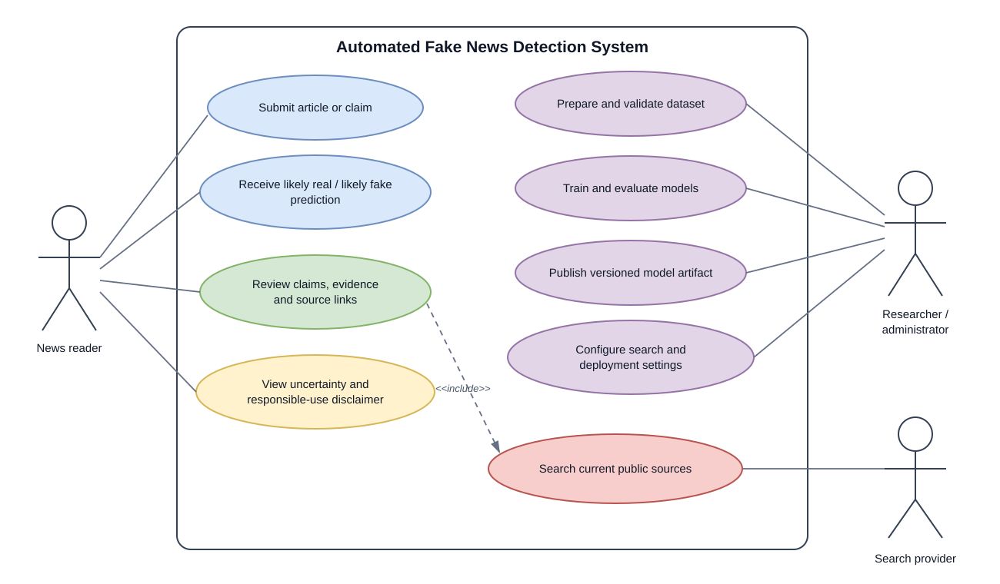
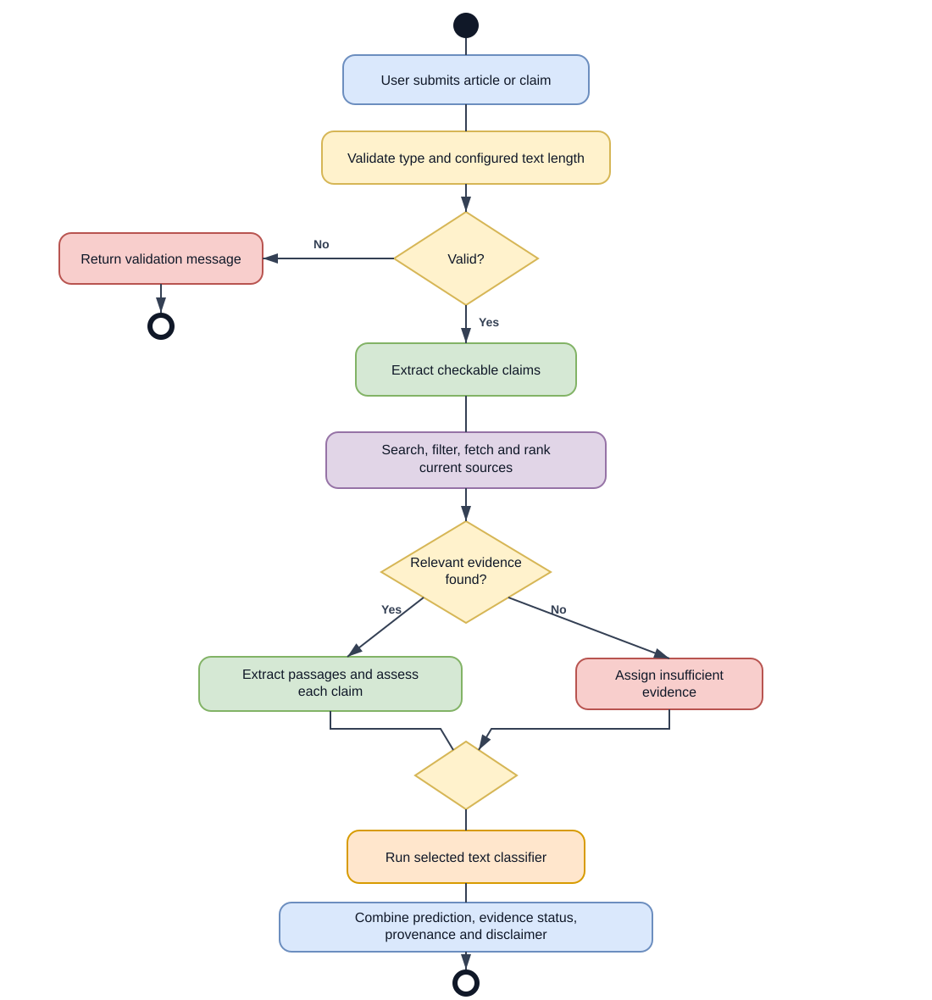
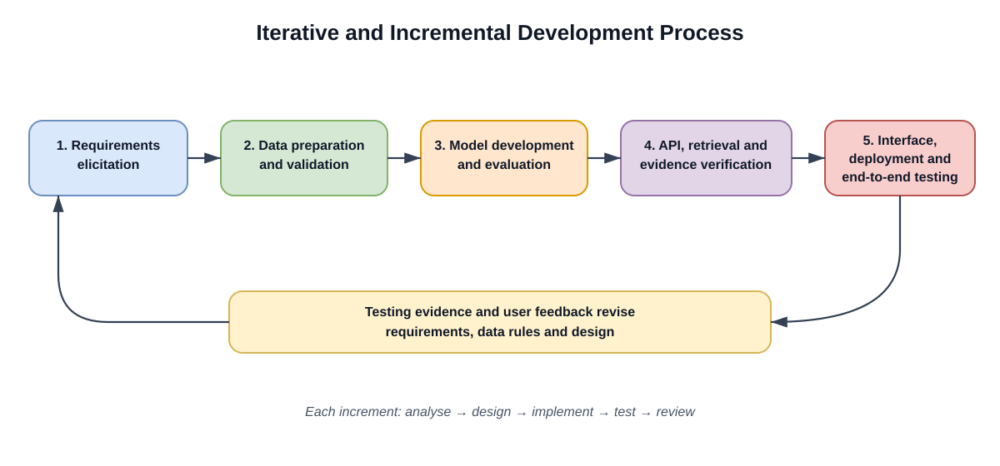
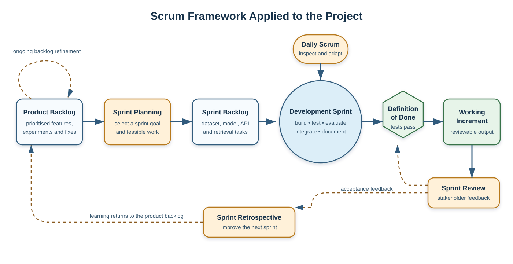

# APPENDIX

This appendix contains supporting diagrams, detailed evaluation tables, example API structures, configuration references, and selected code listings for the implemented system. The materials expand on Chapters Three and Four. Example responses contain illustrative values and do not represent a specific live analysis. API keys and other secret values are intentionally omitted.

## APPENDIX A: SYSTEM AND METHODOLOGY DIAGRAMS

The following diagrams provide larger views of the system actors, analysis workflow, and development methodology.

### Figure A.1: Use Case Diagram



*Figure A.1: User, researcher, administrator, and search-provider interactions with the system.*

### Figure A.2: Activity Diagram for Article Analysis



*Figure A.2: Validation, claim extraction, source retrieval, evidence assessment, selected-model inference, and response assembly.*

### Figure A.3: Iterative Development Methodology



*Figure A.3: Project progression from requirements through data preparation, model evaluation, API and evidence implementation, interface development, deployment, and testing.*

### Figure A.4: Scrum Process Applied to the Project



*Figure A.4: Iterative planning, implementation, review, and backlog refinement.*

## APPENDIX B: DATASET AND MODEL EVALUATION TABLES

### Table B.1: Prepared ISOT Dataset Distribution

| Partition or class | `likely_fake` | `likely_real` | Total |
|---|---:|---:|---:|
| Training | 14,324 | 16,956 | 31,280 |
| Validation | 1,791 | 2,120 | 3,911 |
| Test | 1,790 | 2,119 | 3,909 |
| **Prepared dataset** | **17,905** | **21,195** | **39,100** |

The prepared dataset was produced from 44,898 initial ISOT records. Cleaning, duplicate removal, and removal of conflicting-label texts resulted in 39,100 records. The split was stratified and generated with random seed 42. The class counts in the random test set are visible in the confusion matrices below.

### Table B.2: Random Held-Out Test Performance

| Measure | TF-IDF + Logistic Regression | Fine-tuned DistilBERT |
|---|---:|---:|
| Test records | 3,909 | 3,909 |
| Accuracy | 0.9900 | 0.9995 |
| Macro precision | 0.9901 | 0.9994 |
| Macro recall | 0.9898 | 0.9995 |
| Macro F1-score | 0.9899 | 0.9995 |
| Weighted F1-score | 0.9900 | 0.9995 |
| Expected calibration error | 0.0523 | 0.0004 |
| Brier score | 0.0130 | 0.0005 |
| Mean confidence | 0.9378 | 0.9999 |
| Misclassified records | 39 | 2 |

These are results from the same random held-out ISOT test split. They describe performance on that benchmark and do not establish equivalent performance on independent publishers, newly published articles, or Nigerian news. The transformer errors were made with high confidence, so confidence should not be interpreted as factual certainty.

### Table B.3: Confusion Matrix for TF-IDF and Logistic Regression

Rows show actual labels; columns show predicted labels.

| Actual label | Predicted `likely_fake` | Predicted `likely_real` |
|---|---:|---:|
| `likely_fake` | 1,768 | 22 |
| `likely_real` | 17 | 2,102 |

### Table B.4: Confusion Matrix for Fine-tuned DistilBERT

Rows show actual labels; columns show predicted labels.

| Actual label | Predicted `likely_fake` | Predicted `likely_real` |
|---|---:|---:|
| `likely_fake` | 1,790 | 0 |
| `likely_real` | 2 | 2,117 |

### Table B.5: Temporal Test Result for the Classical Model

| Measure | Result |
|---|---:|
| Test records | 3,909 |
| Accuracy | 0.9936 |
| Macro F1-score | 0.9839 |
| Expected calibration error | 0.0618 |
| Brier score | 0.0116 |

| Actual label | Predicted `likely_fake` | Predicted `likely_real` |
|---|---:|---:|
| `likely_fake` | 426 | 10 |
| `likely_real` | 15 | 3,458 |

This temporal result is available for the classical model. It should not be treated as a direct temporal comparison between the classical model and DistilBERT because a matching temporal transformer evaluation is not reported here.

### Table B.6: Prediction Confidence Distribution

| Confidence interval | Classical count | DistilBERT count | Temporal classical count |
|---|---:|---:|---:|
| 0.0–0.1 | 0 | 0 | 0 |
| 0.1–0.2 | 0 | 0 | 0 |
| 0.2–0.3 | 0 | 0 | 0 |
| 0.3–0.4 | 0 | 0 | 0 |
| 0.4–0.5 | 0 | 0 | 0 |
| 0.5–0.6 | 46 | 0 | 34 |
| 0.6–0.7 | 79 | 0 | 54 |
| 0.7–0.8 | 129 | 0 | 147 |
| 0.8–0.9 | 417 | 0 | 552 |
| 0.9–1.0 | 3,238 | 3,909 | 3,122 |
| **Total** | **3,909** | **3,909** | **3,909** |

## APPENDIX C: API REFERENCE AND EXAMPLE STRUCTURES

### C.1 Analysis Request

The analysis endpoint accepts JSON containing article text. The default deployment limits are 100 to 20,000 non-whitespace characters; the API settings can change these values.

```http
POST /api/v1/analyze
Content-Type: application/json
```

```json
{
  "text": "The full article text to analyse, containing enough context for claim extraction and model inference."
}
```

### C.2 Illustrative Analysis Response

The API returns prediction and verification as separate objects. Values below illustrate the response structure only.

```json
{
  "prediction": {
    "available": true,
    "label": "likely_real",
    "confidence": 0.87,
    "model": "transformer_sequence_classifier",
    "model_version": "transformer-distilbert-0.1.0",
    "processing_time_ms": 125.4,
    "error": null,
    "disclaimer": "This is a machine-learning prediction and should not be treated as independent factual verification."
  },
  "verification": {
    "status": "supported",
    "claims": [
      {
        "claim_id": "claim-001",
        "claim": "An illustrative factual statement from the submitted article.",
        "status": "supported",
        "rationale": "Relevant retrieved passages support this claim.",
        "evidence": [
          {
            "url": "https://example.org/report",
            "text": "Illustrative relevant source passage.",
            "relevance_score": 0.82,
            "title": "Example report",
            "source_name": "Example Organisation",
            "published_at": "2026-01-10T12:00:00+00:00",
            "retrieved_at": "2026-01-11T09:30:00+00:00"
          }
        ]
      }
    ]
  }
}
```

The prediction label is limited to `likely_real` or `likely_fake`. Evidence statuses are `supported`, `contradicted`, `mixed`, and `insufficient`. An unavailable model is represented with `available: false` and an error message; lack of evidence is represented as insufficient evidence and is not proof that a claim is false.

### C.3 Health Check

```http
GET /health
```

Illustrative response:

```json
{
  "status": "ok",
  "environment": "production",
  "model_name": "distilbert"
}
```

### C.4 Validation Behaviour

| Condition | HTTP result | Behaviour |
|---|---:|---|
| Valid article text within configured limits | 200 | Returns prediction and verification objects. |
| Text is shorter than the configured minimum | 422 | Returns a validation detail message. |
| Text exceeds the configured maximum | 422 | Returns a validation detail message. |
| Whitespace-only text | 422 | Rejected because it has no usable non-whitespace content. |

## APPENDIX D: DEPLOYMENT CONFIGURATION REFERENCE

The following table lists configuration names used by the deployed API and web client. Secret values belong in Render's protected environment settings or an equivalent secret manager. They must not be committed to Git or exposed through frontend variables.

### Table D.1: API Environment Variables

| Variable | Purpose | Example or default |
|---|---|---|
| `APP_ENV` | Identifies the running environment. | `production` |
| `PRODUCTION_MODEL` | Selects the production predictor. | `transformer` or `classical` |
| `CLASSICAL_MODEL_PATH` | Location of the classical Joblib artifact. | `models/classical/model.joblib` |
| `TRANSFORMER_MODEL_PATH` | Location of the extracted transformer directory. | `models/transformer/distilbert` |
| `TRANSFORMER_MODEL_ARTIFACT_URL` | URL for the versioned transformer release archive. | GitHub Release asset URL |
| `TRANSFORMER_MODEL_ARTIFACT_SHA256` | Verifies the downloaded archive. | 64-character SHA-256 digest |
| `TRANSFORMER_MODEL_ARTIFACT_TOKEN` | Optional token for a private release asset. | Leave unset for a public asset. |
| `CORS_ORIGINS` | Comma-separated browser origins allowed to call the API. | Deployed Vercel origin |
| `SEARCH_PROVIDER` | Selects the live search adapter. | `brave` |
| `SEARCH_ENDPOINT` | Brave Search web endpoint. | `https://api.search.brave.com/res/v1/web/search` |
| `SEARCH_API_KEY` | Authenticates API search requests. | Store as a Render secret. |
| `SEARCH_MAX_RESULTS` | Maximum search results requested per claim. | `5` for a conservative demo configuration |
| `SEARCH_TIMEOUT_SECONDS` | Timeout for provider and source-page requests. | `15` |
| `EVIDENCE_MAX_SOURCES` | Maximum candidate pages fetched per claim. | `3` for a conservative demo configuration |
| `EVIDENCE_MAX_CLAIMS` | Maximum claims reviewed per article. | `1` for a conservative demo configuration |
| `EVIDENCE_RECENCY_DAYS` | Search freshness window. | `30` |
| `MIN_ARTICLE_LENGTH` | Minimum non-whitespace article length. | `100` |
| `MAX_ARTICLE_LENGTH` | Maximum article length. | `20000` |
| `PORT` | Port assigned by Render. | Supplied automatically by Render. |

The search and evidence limits above are configuration examples for a low-usage demonstration. They do not enforce a daily credit cap or per-user request limit. Those protections require explicit rate limiting and shared usage accounting.

### Table D.2: Web Environment Variables

| Variable | Purpose | Example or default |
|---|---|---|
| `NEXT_PUBLIC_API_URL` | Public base URL used by the browser to contact the API. | `https://your-api-service.onrender.com` |
| `NEXT_PUBLIC_MIN_ARTICLE_LENGTH` | Frontend minimum input length; should match the API. | `100` |
| `NEXT_PUBLIC_MAX_ARTICLE_LENGTH` | Frontend maximum input length; should match the API. | `20000` |

Only public, non-secret values should use the `NEXT_PUBLIC_` prefix. The Brave API key belongs on the API server and must never be supplied to Vercel as a public frontend variable.

## APPENDIX E: SELECTED IMPLEMENTATION LISTINGS

### Listing E.1: Article Length Validation

The API checks the trimmed text length and returns the original input for consistent downstream preprocessing.

```python
def validate_article_text(
    text: str,
    *,
    min_length: int,
    max_length: int,
) -> str:
    article_length = len(text.strip())
    if article_length < min_length:
        raise ValueError(
            f"Article text must contain at least {min_length} non-whitespace characters."
        )
    if article_length > max_length:
        raise ValueError(
            f"Article text must not exceed {max_length} characters."
        )
    return text
```

### Listing E.2: Brave Search Request and Result Mapping

The adapter sends the API key in the request header and maps web results to provider-neutral result records.

```python
params = {"q": query, "count": max_results}
if recency_days is not None:
    params["freshness"] = _brave_freshness(recency_days)

response = httpx.get(
    self.endpoint,
    params=params,
    headers={"Accept": "application/json", "X-Subscription-Token": self.api_key},
    timeout=self.timeout_seconds,
)
response.raise_for_status()
values = response.json().get("web", {}).get("results", [])
```

The actual API key is read from server-side configuration and is not included in this listing.

### Listing E.3: Analysis Workflow

```text
receive article text
validate configured length limits
extract up to the configured number of checkable claims
for each claim:
    query Brave Search when configured
    deduplicate and filter candidate results
    fetch public source pages within response-size limits
    rank source passages and assess the claim
load the configured classical or transformer predictor
assemble prediction and verification as separate response objects
return structured response with source provenance and disclaimer
```

## APPENDIX F: TEST SUITE INDEX

The repository's tests are grouped by responsibility. Unit tests cover data validation and splitting, preprocessing, classical and transformer inference, model artifact handling, settings, claim extraction, query construction, Brave response mapping, source filtering, document-fetch safeguards, evidence extraction, and verification rules. Integration tests cover API health, analysis responses, and the search-provider path. Frontend tests cover the analysis form and site navigation. These tests exercise code behaviour with fixtures; they do not constitute a live-provider accuracy study, user-acceptance study, or production-load test.
