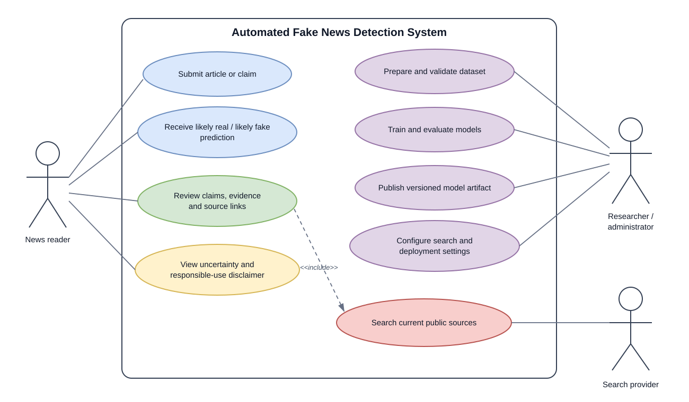
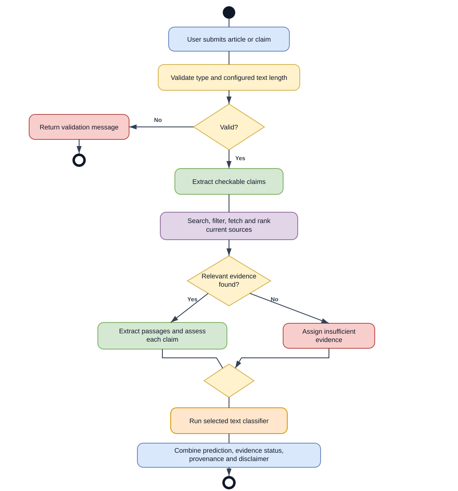
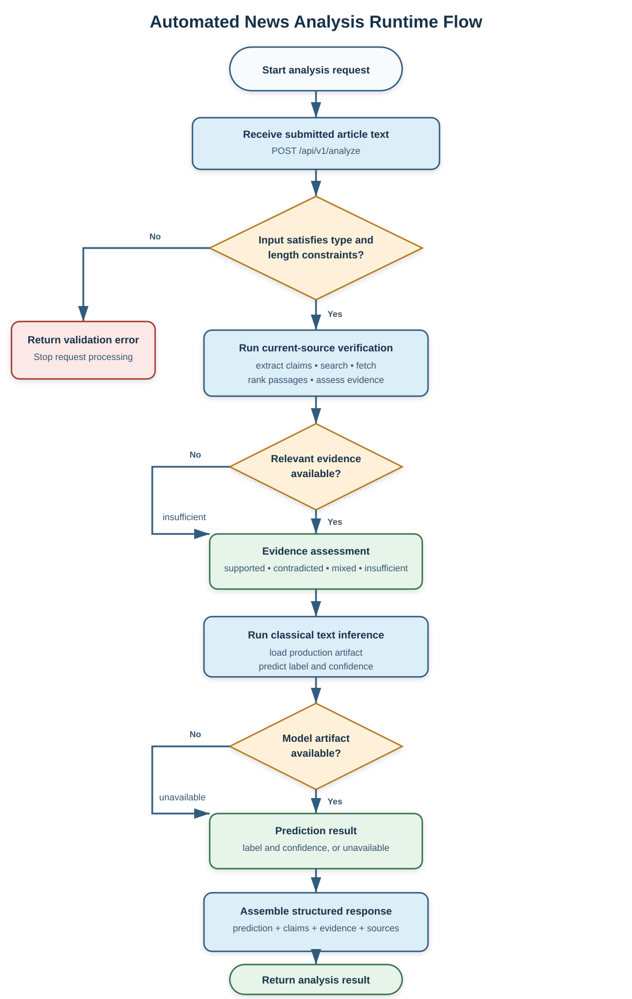
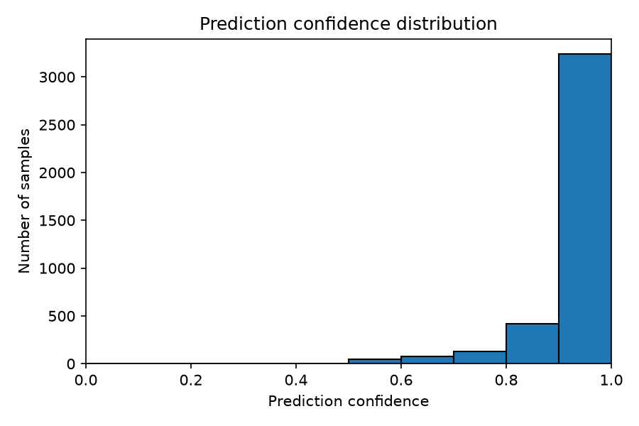
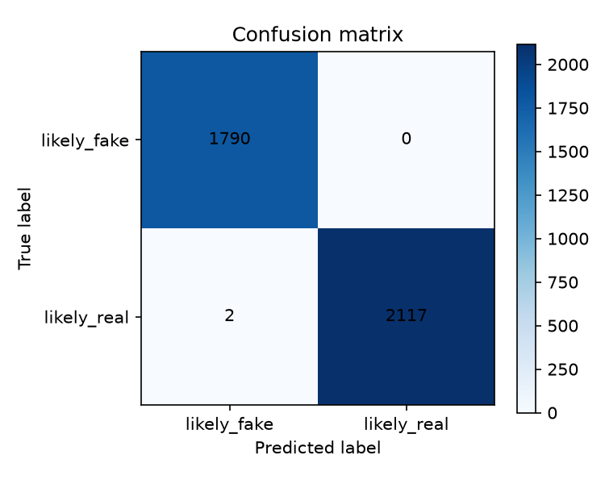
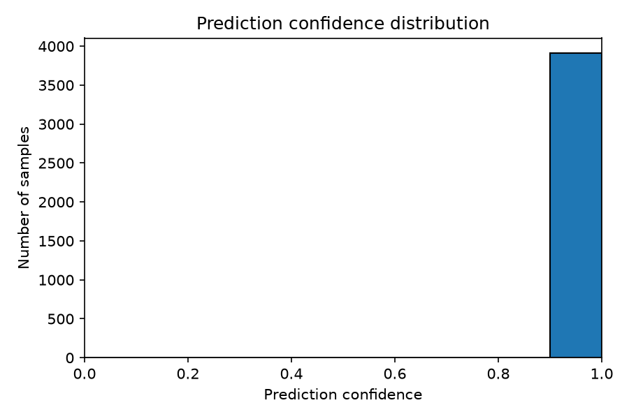

# CHAPTER FOUR

## SYSTEM IMPLEMENTATION AND DESIGN

### 4.1 System Overview

The automated fake-news detection system was developed to help users examine news articles through two complementary forms of analysis. The first is an NLP classifier that estimates whether an article resembles the real or fake reports in its training data. The second is a current-source verification process that extracts checkable claims and searches for relevant online evidence. Keeping these processes distinct prevents a model prediction from being presented as direct proof of factual accuracy.

The classification component contains two model branches. A TF-IDF and Logistic Regression pipeline provides a lightweight classical baseline, while a fine-tuned DistilBERT classifier provides contextual language representation. Both models were developed from the same cleaned ISOT dataset and assessed on the same held-out test set. This common experimental foundation makes differences in their results easier to interpret.

The evidence component addresses a limitation of historical training data: a trained classifier cannot already know every new event or claim. During analysis, the system extracts a bounded set of claims, constructs search queries, retrieves candidate pages or snippets, filters and ranks the sources, extracts relevant passages, and assigns an evidence status of `supported`, `contradicted`, `mixed`, or `insufficient`. Source URLs, titles, publication dates where available, retrieval times, and relevance scores are retained in the response.

The application follows a client-server architecture. A FastAPI service provides health and analysis endpoints, loads the production model artifact, coordinates the evidence pipeline, and returns structured JSON. The presentation layer is designed with Next.js, React, and TypeScript, although implementation during this stage concentrated on the machine-learning and API layers. Deployment-specific values such as API addresses, CORS origins, model paths, artifact URLs, search credentials, recency limits, and timeouts are supplied through environment variables.

The system is intended as a decision-support tool rather than an automatic judge of truth. Its outputs use the cautious labels `likely_fake` and `likely_real`, preserve a separate evidence assessment, and include a disclaimer. This design acknowledges that high performance on a benchmark dataset does not remove the risks of source bias, domain shift, incomplete retrieval, or misleading confidence.

### 4.2 System Requirements

This section presents the resources required to develop, run, and deploy the system. The requirements are grouped into server-side, client-side, and software requirements because model inference and evidence retrieval take place on the API server, whereas users access the service through a browser-based client.

#### 4.2.1 Server-Side Requirements

1. **Hosting environment:** A Python-compatible service capable of running an ASGI application. Render is the intended host for the FastAPI service.
2. **Python runtime:** Python 3.11 to 3.13, with Python 3.12 used during development.
3. **Processor:** A modern multi-core CPU is sufficient for the classical production model. Transformer inference benefits from greater CPU capacity or GPU acceleration.
4. **Memory:** At least 1 GB is advisable for the classical API, with additional memory required if DistilBERT is served directly.
5. **Storage:** Space is required for the application, locked dependencies, and the selected model artifact. The classical artifact is substantially smaller than the DistilBERT directory, whose weights alone are approximately 268 MB.
6. **Internet connectivity:** Outbound network access is required when the evidence pipeline uses a live search provider and fetches public pages. It is also required when a versioned model artifact is downloaded during deployment.
7. **Environment configuration:** The server must receive values for the runtime environment, model path, allowed CORS origins, and any configured search-provider credentials. Secrets must not be committed to the repository.
8. **Transport security:** Production traffic should use HTTPS so submitted text, search credentials, and returned evidence are protected in transit.

#### 4.2.2 Client-Side Requirements

1. **Device:** A desktop computer, laptop, tablet, or smartphone capable of running a modern browser.
2. **Browser:** A current version of Chrome, Firefox, Edge, Safari, or another standards-compliant browser with JavaScript enabled.
3. **Internet connection:** A stable connection is required to submit the article and receive the combined analysis response.
4. **Text input:** The user must provide non-empty article text. The implemented request schema accepts between 1 and 20,000 characters.
5. **Display:** The interface should have enough space to distinguish the model prediction, confidence, claim assessments, evidence passages, sources, dates, and disclaimer without merging them into one verdict.

No microphone, camera, biometric device, or browser extension is required because the system analyses text.

#### 4.2.3 Software Requirements

1. **Programming languages:** Python is used for the API, data pipeline, model training, evaluation, retrieval, and verification. TypeScript supports the web client.
2. **API framework:** FastAPI provides routing, dependency injection, schema validation, OpenAPI documentation, and response serialisation. Uvicorn runs the ASGI application.
3. **Data libraries:** Pandas and NumPy support dataset preparation and numerical operations. PyArrow supports efficient dataset interchange where required.
4. **Classical machine learning:** scikit-learn provides TF-IDF vectorisation, Logistic Regression, splitting utilities, and evaluation metrics. Joblib stores and reloads the fitted pipeline.
5. **Transformer machine learning:** PyTorch, Hugging Face Transformers, Datasets, and Accelerate support tokenisation, DistilBERT fine-tuning, batched inference, and artifact storage.
6. **Retrieval and verification:** HTTPX handles search and page requests. Custom Python modules perform claim extraction, query construction, source filtering, ranking, evidence extraction, and verification.
7. **Visualisation:** Matplotlib and Seaborn generate confusion matrices and confidence-distribution plots.
8. **Testing and quality checks:** Pytest provides unit and integration testing, while Ruff supports static analysis and formatting checks.
9. **Dependency management:** Project dependencies are declared in `pyproject.toml`, resolved in `uv.lock`, and installed through `uv`.
10. **Frontend technologies:** Next.js, React, TypeScript, HTML, and CSS form the intended presentation layer.
11. **Version control and deployment:** Git and GitHub manage source history and versioned releases. Render is intended for the API and Vercel for the web client.

### 4.3 System Design

The system was designed as a collection of modules with clearly separated responsibilities. Offline modules prepare the dataset, train the models, save their artifacts, and produce evaluation reports. Online modules validate a submitted article, obtain a model prediction, search for current evidence, and return a combined response. This separation makes the model experiments reproducible while allowing the evidence available at analysis time to remain current.

The API route does not contain the complete retrieval or inference logic. Instead, it receives the inference service and verification pipeline through dependency injection. This arrangement permits deterministic tests to substitute temporary artifacts, in-memory search results, or controlled evidence pages without changing the production route. The following diagrams present the principal actors and runtime flow.

#### 4.3.1 Use Case Diagram

The use case diagram identifies the people and external services that interact with the system. The news reader submits an article or claim and receives the resulting prediction and evidence assessment. A model developer prepares the dataset, trains and evaluates the models, and publishes a versioned artifact for deployment. The search provider supplies current result candidates used by the evidence pipeline.



*Figure 4.1: Use case diagram for the automated fake-news detection system*

The diagram separates user-facing analysis from offline model development. This is necessary because users do not train the model when they submit an article, and the search provider does not determine the classifier's label. Its role is limited to providing candidate material that the evidence pipeline must still filter and assess.

#### 4.3.2 Activity Diagram

The activity diagram describes the sequence followed after an article is submitted. Validation occurs before expensive processing. Valid text enters the evidence-verification and classification activities, after which the system combines the two outputs. Invalid input ends with a validation response, while unavailable or inadequate evidence leads to `insufficient` rather than a forced factual judgement.



*Figure 4.2: Activity diagram for article analysis*

The two analytical branches answer different questions. Classification asks which training label the article most closely resembles. Verification asks what the retrieved sources indicate about the extracted claims. Their results are therefore kept in separate response objects even though they are returned by one API request.

#### 4.3.3 Flowchart Diagram

The flowchart provides a simplified view of the runtime decisions made by the analysis endpoint. It includes the two controlled-failure conditions that are especially important in deployment: absence of a model artifact and absence of adequate evidence. Neither condition prevents the response from accurately describing what was and was not available.



*Figure 4.3: Runtime flowchart for automated news analysis*

When the classical artifact is available, the inference service returns the label, confidence, model identity, model version, processing time, and disclaimer. If it is unavailable, the prediction object reports that state without inventing a label. In the evidence branch, successful retrieval can lead to supported, contradicted, or mixed assessments; weak or missing evidence leads to insufficient evidence. The final response assembles both branches with the extracted claims and source provenance.

### 4.4 System Design Output/Result

The implemented outputs are currently exposed through the FastAPI service and the reproducible evaluation reports. The complete browser interface is not presented as a finished result at this stage. Consequently, this section reports the observable API and machine-learning outputs rather than using illustrative interface screenshots that the implemented system does not yet produce.

#### (i) API Health and Article-Analysis Output

The `GET /health` endpoint confirms that the API process is available and returns the active environment and configured model name. The principal analysis operation is `POST /api/v1/analyze`. It accepts an object containing article text and returns two top-level objects: `prediction` and `verification`.

A shortened representation of the response structure is shown below. The values of claims, sources, dates, confidence, and evidence status vary with the submitted article, configured model artifact, search provider, and evidence available at request time.

```json
{
  "prediction": {
    "available": true,
    "label": "likely_fake",
    "confidence": 0.86,
    "model": "tfidf_logistic_regression",
    "model_version": "classical-tfidf-logreg-0.1.0",
    "processing_time_ms": 4.2,
    "disclaimer": "This is a machine-learning prediction and should not be treated as independent factual verification."
  },
  "verification": {
    "status": "insufficient",
    "claims": [
      {
        "claim_id": "claim-1",
        "claim": "Extracted checkable claim",
        "status": "insufficient",
        "evidence": [],
        "rationale": "No sufficiently relevant evidence was retrieved."
      }
    ]
  }
}
```

The example demonstrates why prediction and verification are not collapsed into one label. An article may strongly resemble one class while current-source evidence is unavailable. The structured response preserves that uncertainty and enables the client to communicate it directly.

#### (ii) Classical Model Evaluation Output

The TF-IDF and Logistic Regression model was evaluated on 3,909 held-out records. Table 4.1 presents the main results.

**Table 4.1: Classical-model performance on the random held-out test set**

| Measure | Result |
|---|---:|
| Accuracy | 0.9900 |
| Macro precision | 0.9901 |
| Macro recall | 0.9898 |
| Macro F1-score | 0.9899 |
| Weighted F1-score | 0.9900 |
| Expected calibration error | 0.0523 |
| Brier score | 0.0130 |
| Mean prediction confidence | 0.9378 |

The confusion matrix contained 1,768 correctly identified `likely_fake` articles and 2,102 correctly identified `likely_real` articles. Twenty-two `likely_fake` articles were predicted as `likely_real`, while seventeen `likely_real` articles were predicted as `likely_fake`, producing 39 errors in total.


*Figure 4.4: Confusion matrix for TF-IDF and Logistic Regression*



*Figure 4.5: Prediction-confidence distribution for TF-IDF and Logistic Regression*

Most predictions fell above 0.90 confidence, but the lower-confidence bins contained a larger proportion of mistakes. The expected calibration error of 0.0523 shows that the probabilities were not perfectly aligned with observed correctness. The confidence score should therefore be interpreted as the model's degree of preference between its learned classes, not as a probability that an article is factually true.

The classical model was also evaluated with a temporal split containing 3,909 later records. It obtained 0.9936 accuracy and 0.9839 macro F1-score, with a confusion matrix of `[[426, 10], [15, 3458]]`. The large difference between the numbers of fake and real examples in this test set makes macro F1-score more informative than accuracy alone. Although the result was strong, it did not remove the broader risk that ISOT models learn source, topic, or period-specific patterns.

#### (iii) Transformer Model Evaluation Output

The fine-tuned DistilBERT model was evaluated on the same 3,909-record random test set. The completed training run used a maximum sequence length of 256, training batch size of 8, evaluation batch size of 16, learning rate of 2 × 10⁻⁵, weight decay of 0.01, random seed 42, and one training epoch. Training was performed on a CPU and required approximately 17.5 hours.

**Table 4.2: DistilBERT performance on the random held-out test set**

| Measure | Result |
|---|---:|
| Accuracy | 0.9995 |
| Macro precision | 0.9994 |
| Macro recall | 0.9995 |
| Macro F1-score | 0.9995 |
| Weighted F1-score | 0.9995 |
| Expected calibration error | 0.0004 |
| Brier score | 0.0005 |
| Mean prediction confidence | 0.9999 |

The transformer correctly classified all 1,790 `likely_fake` test records. Of the 2,119 `likely_real` records, 2,117 were correct and two were predicted as `likely_fake`. Its confusion matrix was therefore `[[1790, 0], [2, 2117]]`.



*Figure 4.6: Confusion matrix for the fine-tuned DistilBERT model*



*Figure 4.7: Prediction-confidence distribution for the fine-tuned DistilBERT model*

Every transformer prediction had confidence above 0.90, and the mean confidence was approximately 0.9999. The two errors were legitimate Reuters articles from `True.csv`, yet the model predicted the fake class with high confidence. This finding is important: excellent benchmark accuracy and apparent calibration on the same test distribution do not establish dependable factual verification on new publishers or current Nigerian news. For this reason, the transformer result supports further comparative study but does not replace the evidence-retrieval branch or human judgement.

### 4.5 System Implementation

Implementation was organised around the same separation used in the design. The `ml` package contains dataset, preprocessing, classical, transformer, evaluation, retrieval, verification, and inference modules. The `apps/api` package contains settings, request and response schemas, dependencies, routes, and application services. Tests exercise individual rules and connected API workflows with deterministic fixtures.

The implementation avoids embedding deployment-specific values in source code. Pydantic Settings reads local development values from an optional `.env` file and production values from the hosting environment. Python dependencies and development tools are version-resolved through `uv.lock`. Large model artifacts remain outside normal Git history and can be distributed as versioned GitHub Release assets with an optional SHA-256 integrity check.

#### 4.5.1 System Architecture

The runtime architecture consists of a browser client, a FastAPI service, an inference service, a verification pipeline, a model artifact, and an external search provider. The browser sends article text to the API. FastAPI validates the request and obtains the inference and verification components through dependency injection. The inference service loads the saved classical model and returns a prediction. The verification pipeline extracts claims, searches for evidence, fetches bounded page content, ranks passages, and aggregates claim assessments. The route serialises both results into one response.

The production API currently uses the classical predictor because its small artifact and CPU-friendly inference are better suited to constrained hosting. The transformer has been trained and evaluated offline but is not yet connected to the production analysis route. This distinction prevents an offline experiment from being described as a deployed capability.

The API is stateless and does not store submitted articles. Cross-origin browser access is limited by `CORS_ORIGINS`. A health endpoint supports deployment monitoring, and missing artifacts or insufficient evidence are represented as controlled response states rather than server crashes or fabricated conclusions.

#### 4.5.2 Text Preprocessing

Preprocessing differs between the two model branches. Both begin with a common stage that checks the input type, removes unnecessary whitespace, and ensures that usable text remains. During dataset construction, the article title and body are combined so the model can use information from both fields.

The classical pipeline applies TF-IDF vectorisation directly to the normalised text. Its configuration permits up to 50,000 features, includes unigrams and bigrams, uses sublinear term frequency, ignores terms appearing in more than 95 per cent of documents, and retains a minimum document frequency of one. Logistic Regression uses a maximum of 1,000 iterations and random state 42. The fitted vectoriser and classifier are saved together, ensuring that production input undergoes the same transformation used during training.

The transformer pipeline uses the `distilbert-base-uncased` tokenizer. Inputs are padded or truncated to a maximum of 256 tokens and accompanied by attention masks. Unlike the classical branch, it does not apply stemming or aggressive stop-word removal because the pretrained model relies on word order and context. The public labels are mapped consistently as `likely_fake = 0` and `likely_real = 1`.

#### 4.5.3 Model Training and Artifact Generation

The classical training module reads the prepared training CSV, validates that both labels are present, fits the TF-IDF and Logistic Regression pipeline, and saves a Joblib dictionary containing the estimator and model metadata. The prediction class reloads this artifact and verifies the required fields before serving inference. Each result contains the model name and version so that later outputs remain traceable to a particular artifact.

The transformer training module tokenises the training and validation records, loads DistilBERT with a two-class classification head, and fine-tunes the network through the Hugging Face Trainer interface. The pretrained classification layers are newly initialised, while the encoder begins from the downloaded DistilBERT weights. After training, the model, tokenizer, training arguments, and project metadata are saved in a Hugging Face-compatible directory.

Evaluation is kept separate from training. The classical and transformer evaluators load saved artifacts and make batched predictions on the held-out test set. Shared metric functions calculate classification, confusion-matrix, confidence-distribution, and calibration outputs. Keeping evaluation separate reduces the risk of adjusting the final model after observing its test errors.

#### 4.5.4 Data Implementation

The raw ISOT files contain 23,481 fake and 21,417 real articles, giving 44,898 records before cleaning. The data pipeline assigns the canonical labels `likely_fake` and `likely_real`, preserves relevant metadata, normalises text, removes empty records, drops exact duplicates, and excludes texts that occur with conflicting labels.

The prepared dataset contains 39,100 records: 17,905 `likely_fake` and 21,195 `likely_real`. A deterministic stratified split with random seed 42 produced the distribution shown in Table 4.3.

**Table 4.3: Prepared ISOT dataset split**

| Dataset partition | Number of records | Purpose |
|---|---:|---|
| Training | 31,280 | Fitting model parameters |
| Validation | 3,911 | Monitoring and configuration decisions |
| Test | 3,909 | Final held-out evaluation |
| **Total** | **39,100** | Cleaned dataset |

Automated checks verify required columns, permitted labels, non-empty text, duplicates, conflicting labels, reproducible splitting, and separation between train and test data. The temporal strategy sorts parseable dates, places later records in the test set, and reports malformed dates rather than silently treating them as valid. Six malformed date values were excluded from that temporal experiment.

Processed CSV files and raw datasets are kept outside normal source-control history because of their size. Evaluation reports are written as JSON, CSV, and PNG files, while models are stored as Joblib or Hugging Face artifacts. A database was unnecessary because the API does not manage user accounts or retain submitted content.

#### 4.5.5 API and Web Interface Implementation

FastAPI creates the application, registers the routers, loads settings, and configures CORS from environment variables. Pydantic schemas enforce the request and response structures. `GET /health` exposes deployment-safe status information, while `POST /api/v1/analyze` coordinates the classifier and evidence pipeline. FastAPI's generated OpenAPI documentation also provides an interactive means of examining the endpoints during development.

The Next.js project contains the foundation for the browser client, including a shared layout, a basic page, TypeScript configuration, and an environment-aware API URL helper. `NEXT_PUBLIC_API_URL` identifies the deployed API without hard-coding localhost or Render addresses. The complete article form and result presentation remain to be implemented after the ML and API behaviour has been finalised. Accordingly, this chapter does not present unfinished mock-ups as completed interfaces.

The intended result view will keep classification and verification visually separate. It will display the predicted class and confidence, followed by claim-level evidence statuses, relevant passages, source links, and available dates. Loading, validation, network failure, missing-model, and insufficient-evidence states will require distinct messages so users are not given a false sense of certainty.

#### 4.5.6 Integration and Workflow

The integrated workflow begins when article text reaches the analysis endpoint. Pydantic validates the request before the route calls the verification pipeline and inference service. The verification pipeline extracts a bounded number of claims, constructs queries, obtains search results through a provider-neutral client, applies source rules, retrieves bounded page content, ranks documents, extracts relevant passages, and aggregates the claim-level findings. The inference service independently loads the classical artifact and predicts a label and confidence.

The route converts internal objects into a stable public schema and returns the two branches together. If one page fails, other evidence candidates can still be processed. If the search provider is not configured or no reliable evidence is found, the result becomes `insufficient`. If the model artifact is missing, `prediction.available` becomes `false` and an explanatory error is returned while the evidence branch remains usable.

Unit tests cover data loading, label mapping, duplicate removal, splitting, preprocessing, classical prediction, transformer tokenisation, evaluation metrics, claim extraction, query construction, source filtering, evidence extraction, model download, configuration, and verification rules. Integration tests follow requests through FastAPI, dependency injection, prediction, evidence assessment, and response serialisation. This layered testing makes it possible to identify whether a failure originates in an individual rule, a persisted artifact, an external-service adapter, or the connected API workflow.
