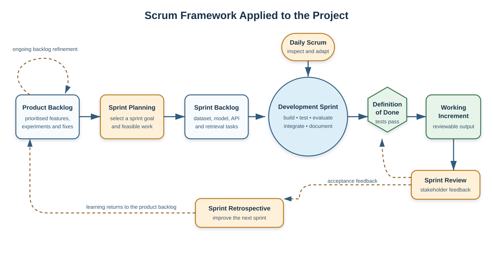

# CHAPTER THREE

## RESEARCH METHODOLOGY

### 3.1 Methodology Adopted

This study adopted a hybrid methodology that combines Agile development through the Scrum framework with the Machine Learning Development Life Cycle (MLDLC). The choice reflects the nature of the work. Building an automated fake-news detection system is both a software-engineering task and an experimental machine-learning task. The software must accept an article, validate it, call the appropriate services, and return a clear result. At the same time, the dataset must be cleaned, the models must be trained without leakage, and performance must be evaluated on unseen examples.

Scrum provides the short, reviewable development cycles needed to connect these parts gradually. MLDLC provides the technical discipline needed for data preparation, training, evaluation, deployment, and monitoring. The approaches were used together: Scrum managed *when* work was selected, reviewed, and improved, while MLDLC guided *how* the machine-learning work was carried out.

Requirements were derived from the objectives and literature discussed in Chapters One and Two, an examination of comparable verification workflows, and a questionnaire designed for prospective users. As questionnaire administration had not been completed at this stage of the study, the initial requirements were drawn from the literature and system objectives. They will be reviewed against the questionnaire findings when the response data become available.

### 3.2 Agile Methodology

Agile development organises work into small increments and encourages regular feedback instead of postponing integration until the end. This is useful for machine-learning systems because model behaviour, data problems, and deployment constraints often become visible only after an early version is tested. A highly accurate notebook experiment, for example, may still be unsuitable if its artifact cannot be loaded within the memory available to the deployed API.

The Agile approach supported gradual implementation of the dataset pipeline, classical baseline, transformer experiment, evaluation reports, FastAPI service, and current-source verification pipeline. Each increment was expected to be usable and testable before the next one began. Automated tests and documented configuration reduced the risk that an improvement in one part would silently break another.

#### The Agile Manifesto

The Agile Manifesto expresses four values: people and their interactions, working software, collaboration with stakeholders, and responsiveness to change. In this study, these values were interpreted in a practical academic context.

1. **Individuals and interactions:** Regular consultation creates room to examine progress, assumptions, findings, and limitations. Technical tools support this exchange but do not replace thoughtful discussion.
2. **Working software:** A tested dataset loader, trained classifier, or functioning API endpoint provides stronger evidence of progress than an unverified design description.
3. **Stakeholder collaboration:** Requirements and output wording should reflect how people encounter and assess online information. The questionnaire and periodic reviews provide opportunities to align the system with these needs.
4. **Responding to change:** Findings from data validation, model evaluation, error analysis, or deployment testing can change backlog priorities. The methodology permits those changes without abandoning the overall objectives.

Agile does not mean working without documentation or planning. In this study, research records, source citations, model metadata, locked dependencies, automated tests, and evaluation reports form part of a completed increment. This interpretation is important because reproducibility is a core requirement of academic machine-learning work.

#### 3.2.1 Scrum Framework

Scrum is an iterative framework in which a product is developed through time-boxed sprints. It defines accountabilities, events, and artifacts that make progress and problems visible (Schwaber & Sutherland, 2020). In the context of this study, one person may carry out responsibilities that would normally be shared across a development team, while periodic reviews and prospective-user feedback provide the required external perspective.

The **Product Owner** responsibility involves maintaining the product goal and prioritising the backlog. The backlog contains research and engineering items such as cleaning the ISOT dataset, preventing duplicate leakage, training the TF-IDF and Logistic Regression baseline, fine-tuning DistilBERT, evaluating both models, exposing analysis through FastAPI, and retrieving evidence from current sources. The **Scrum Master** responsibility involves keeping the process visible and resolving obstacles such as limited storage, CPU-only training, dependency problems, and deployment constraints. The **Developer** responsibility covers implementation, testing, experimentation, documentation, and integration.

The Scrum events applied to the work are:

1. **Sprint Planning:** A small set of related backlog items and a clear sprint goal are selected.
2. **Daily Scrum:** Progress, next actions, and obstacles are inspected briefly. In an individual project this can be a concise daily development log.
3. **Sprint Review:** A working increment and its evidence, such as passing tests or an evaluation report, are examined with stakeholders.
4. **Sprint Retrospective:** The development process is reviewed and improvements are selected for the next sprint.

The main artifacts are the **Product Backlog**, which records prioritised work; the **Sprint Backlog**, which contains work selected for the current sprint; and the **Increment**, which is the integrated result satisfying the definition of done. For this project, that definition includes correct implementation, relevant automated tests, reproducible configuration, updated documentation, and an explicit record of known limitations.

*Figure 3.1: Scrum framework applied to the automated fake-news detection project*

Figure 3.1 illustrates how Scrum was applied to the development process. Work moves from the product backlog through sprint planning and the sprint backlog into a development sprint. The Daily Scrum supports inspection and adjustment while the sprint is in progress. Before an increment is presented for review, it must satisfy the agreed definition of done. Observations from the Sprint Review and lessons from the Sprint Retrospective are then returned to the product backlog, allowing unfinished work and new insights to shape subsequent priorities.

Scrum offers early discovery of integration problems, frequent testing, visible priorities, and responsiveness to feedback. Its weaknesses are also relevant. A single-researcher project cannot reproduce every team interaction assumed by Scrum; frequent changes can cause scope growth; and short-term delivery can displace documentation unless documentation is included in the definition of done.

### 3.3 Machine Learning Development Life Cycle (MLDLC)

The MLDLC structures the activities required to move from raw data to a monitored machine-learning service. Machine-learning systems accumulate risks outside the model, including data dependencies, configuration errors, training-serving differences, and weak monitoring (Sculley et al., 2015). Amershi et al. (2019) similarly show that production machine learning requires coordinated practices across data, models, software, and operations. The lifecycle used in this study contains these connected stages:

1. **Problem and success definition:** The task is binary textual classification supported by a separate evidence-verification result. The classifier returns `likely_fake` or `likely_real` with confidence, while the evidence branch may return `supported`, `contradicted`, `mixed`, or `insufficient`.
2. **Data acquisition:** The study uses the ISOT Fake News Dataset, supplied as `Fake.csv` and `True.csv` (Ahmed et al., 2017). Title, text, subject, date, label, and source-file information are retained where possible.
3. **Data preparation:** Empty inputs are removed, whitespace is normalised, title and body are combined, exact duplicates are dropped, and texts with conflicting labels are excluded. The cleaned data are divided deterministically into training, validation, and held-out test sets. A temporal split is also available to examine time-related generalisation.
4. **Model development:** A TF-IDF and Logistic Regression pipeline provides the classical baseline. A fine-tuned DistilBERT sequence classifier provides the contextual deep-learning model. Shared labels and test records permit a meaningful comparison.
5. **Evaluation:** Accuracy, macro and weighted precision, recall, F1-score, confusion matrices, confidence distributions, expected calibration error, and Brier score are calculated. Per-row predictions support error analysis. High scores are interpreted cautiously because source and writing style may act as shortcuts.
6. **Integration and deployment:** The selected artifact is loaded behind FastAPI. Configuration comes from environment variables, and large artifacts may be downloaded from a versioned GitHub Release. The API is intended for Render and the later Next.js client for Vercel.
7. **Monitoring and improvement:** Health status, artifact availability, response time, retrieval failures, input drift, and limitations should be monitored. Problems return to the product backlog rather than being hidden by a single score.

The current-source branch follows its own pipeline within the lifecycle. Checkable claims are extracted, search queries are generated, candidate sources are fetched and filtered, relevant passages are ranked, and the passages are compared with each claim. This branch is evaluated separately because a classifier can be available while web evidence remains insufficient, and a retrieval failure must not be presented as proof that a claim is false.

The strengths of MLDLC are traceability, repeatability, attention to data quality, and continuous evaluation. Its limitations include the need for specialised knowledge, substantial computing and storage resources, dependence on dataset quality, and continuing maintenance after deployment. These are material because transformer training was performed locally on a CPU and current-source verification depends on changing external pages and search services.

### 3.4 Why Agile (Scrum) and MLDLC Were Chosen

#### Why Agile (Scrum)

Scrum was chosen because the system contains components that benefit from early integration. Dataset preparation affects training; training determines the artifact format; the artifact format influences API loading; and the API response shapes the user interface. Short sprints made these dependencies visible at manageable stages and allowed insights from stakeholder reviews, questionnaire findings, error analysis, and deployment tests to be incorporated into later work.

#### Why MLDLC

MLDLC was chosen because ordinary software completion criteria are not enough for a predictive system. A route can return a technically valid response even when its model was trained on duplicated data or tested on records seen during training. The lifecycle requires data validation, split separation, experiment metadata, held-out evaluation, artifact management, and monitoring. These controls make the study more reproducible and its conclusions more defensible.

#### Why the Combination

Neither approach fully covers the project by itself. Scrum manages priorities, review, and adaptation but does not prescribe how to prevent leakage or evaluate calibration. MLDLC provides the technical machine-learning sequence but not a lightweight rhythm for stakeholder feedback and software integration. Combining them offers both flexibility and experimental discipline: Scrum wraps work in reviewable sprints, while MLDLC defines technical quality gates within those sprints.

### 3.5 Steps in the Combined Methodology as Applied to This Project

1. **Define the product and research goal:** The system should analyse submitted news text, provide a cautious NLP classification, and retrieve traceable evidence from current sources.
2. **Create and refine the product backlog:** Requirements were translated into dataset, modelling, retrieval, API, testing, documentation, and deployment tasks.
3. **Plan a focused sprint:** Related tasks were selected under one goal, such as producing a leakage-resistant dataset or connecting a saved model to the API response.
4. **Acquire and validate data:** The ISOT files were loaded, labelled, cleaned, deduplicated, checked for conflicts, and validated before training.
5. **Prepare reproducible splits:** Stratified random splits and an optional temporal split were generated. Tests ensured that no cleaned article appeared across training and test sets.
6. **Develop a baseline:** TF-IDF and Logistic Regression were trained first to establish a fast, interpretable reference point.
7. **Develop the contextual model:** DistilBERT was fine-tuned using the same labels and evaluated on the same held-out test set.
8. **Evaluate and review:** Classification, calibration, confusion-matrix, confidence-distribution, and error-analysis outputs were generated and interpreted as evidence rather than merely as a success score.
9. **Integrate the increment:** FastAPI settings, schemas, routes, artifact loading, and current-source verification were connected and tested.
10. **Demonstrate and obtain feedback:** Working endpoints, reports, and diagrams were reviewed. New requirements and limitations returned to the backlog.
11. **Prepare for deployment and monitoring:** Environment-driven configuration, CORS, health checks, artifact download, bounded retrieval, and controlled failures were incorporated.

### 3.6 Benefit of the Combined Methodology over SSADM, OOADM, and Prototyping

1. **Over SSADM:** SSADM offers extensive documentation and a sequential structure, but it is less convenient when data findings or model behaviour require repeated experimentation. The hybrid approach retains documentation while allowing revision between sprints.
2. **Over OOADM:** Object-oriented analysis is useful for describing software responsibilities, but it does not by itself address data cleaning, leakage, calibration, artifacts, or drift. This methodology keeps modular design while adding an explicit ML lifecycle.
3. **Over prototyping:** Prototyping reveals interface needs early, but an attractive prototype may conceal an unevaluated model. Scrum retains incremental demonstrations, while MLDLC requires evidence that each predictive increment is valid and reproducible.

The combination is more suitable because it treats the interface, API, retrieval process, data, model, and research evidence as parts of one system without assuming that they must all mature at the same pace.

### 3.7 Methods and Practices

#### 3.7.1 Sprint Planning

Sprint planning converted high-priority backlog items into a measurable goal. The first sprints established the repository structure and reproducible configuration. Subsequent sprints addressed the API, evidence retrieval, ISOT loading and splitting, classical-model training, transformer fine-tuning, evaluation, and documentation. The amount of work selected for each sprint reflected the available storage, CPU time, deployment limits, and research schedule.

#### 3.7.2 Daily Stand-Up Meetings

Because development was undertaken as an individual study, the Daily Scrum took the form of a brief progress check rather than a team meeting. Each check recorded completed work, the next action, and any obstacle affecting progress. These obstacles included insufficient disk space during dataset export, the lengthy duration of CPU-based transformer training, and deployment limits on model storage. Keeping a record of them supported realistic planning and helped distinguish methodological concerns from limitations of the development environment.

#### 3.7.3 Sprint Review

At the end of each sprint, the increment was examined using observable evidence. Dataset work was reviewed through validation output and separation tests, model work through saved artifacts and held-out metrics, and API work through health and analysis requests. Issues identified during these reviews were recorded in the backlog and considered in subsequent sprints. Questionnaire findings will provide an additional basis for refinement when the completed responses are analysed.

#### 3.7.4 Sprint Retrospective

The retrospective examines how the work was performed. It asks what should continue, what caused avoidable delay, and what should change. Storage failures encouraged earlier disk-space checks and smaller intermediate outputs, while CPU training cost reinforced the value of completing a classical baseline first. These lessons improve the next sprint without changing reported results after the fact.

#### 3.7.5 Product Backlog Management

The backlog contains features, experiments, defects, documentation, and risk-reduction work. Current items include stronger claim extraction, live-search provider configuration, source-diversity checks, transformer serving decisions, interface completion, deployment testing, and monitoring. An item is not complete merely because code exists; tests, documentation, configuration, and limitations are also required.

### 3.8 Tools and Technologies

#### 3.8.1 Programming Language

**Python 3.12** is the main language for dataset preparation, model development, evaluation, retrieval, verification, and the API. It was selected because the required data-science and NLP libraries share a mature Python ecosystem. **TypeScript** supports the web client and provides static checking for interface components and API response structures.

#### 3.8.2 Libraries and Frameworks

**Pandas** and **NumPy** support data preparation and numerical operations. **scikit-learn** supplies TF-IDF, Logistic Regression, splitting utilities, and classification metrics. **PyTorch** supports transformer optimisation, while **Hugging Face Transformers and Datasets** provide DistilBERT, tokenisation, training, and artifact interfaces (Paszke et al., 2019; Wolf et al., 2020). **Joblib** persists the classical pipeline.

**FastAPI** implements the HTTP service, and **Pydantic** validates settings, requests, and responses. **HTTPX** retrieves search results and public pages with controlled timeouts. **Pytest** supports unit and integration testing. **Matplotlib** and **Seaborn** produce evaluation plots. Dependencies are declared in `pyproject.toml`, resolved in `uv.lock`, and installed through `uv`.

#### 3.8.3 Database Management

The system does not require a database within the present scope. Training data and evaluation outputs are stored as CSV, JSON, and PNG files, while model artifacts are stored as Joblib files or Hugging Face directories. The API remains stateless and does not retain submitted articles, thereby reducing unnecessary data storage and its associated privacy risks. Database support would become necessary only if later requirements introduced user accounts, saved analyses, feedback records, or an audit history.

#### 3.8.4 Frontend Technologies

The presentation layer is designed with **Next.js**, **React**, **TypeScript**, HTML, and CSS. Its API address is supplied through `NEXT_PUBLIC_API_URL`, allowing the Vercel-hosted client to communicate with the Render-hosted API without embedding a deployment address in the source code. The interface is intended to distinguish the linguistic prediction from the evidence assessment and to display source URLs, publication dates, confidence, and uncertainty clearly. Development at this stage concentrated on the machine-learning and API layers; full implementation of the user interface follows after these underlying services have been validated.

#### 3.8.5 Development Environment

Development is performed on Windows using PowerShell, Visual Studio Code, Git, GitHub, `uv`, and JupyterLab where exploration is appropriate. Draw.io-compatible XML and SVG files provide editable diagrams. Render is the intended API host and Vercel the intended web host. Environment variables configure CORS, model paths, artifact URLs and hashes, search credentials, recency windows, request limits, and timeouts; secrets and deployment-specific values are not embedded in source code.

### 3.9 Limitations of the Combined Methodology to This Project

1. Scrum is designed for collaborative teams, so some roles and meetings are simplified in an individual academic project.
2. Short iterations can encourage scope growth when each experiment reveals another possible feature.
3. MLDLC cannot correct unrepresentative labels or publisher bias already present in the source dataset.
4. Random splitting may overestimate generalisation when articles share sources, topics, or time periods.
5. Transformer experiments require substantial storage, memory, and computation; local CPU training makes repeated runs expensive.
6. Current-source retrieval depends on search services, changing pages, publication dates, and source quality outside the researcher's control.
7. The evidence verifier is a transparent lexical baseline, not a replacement for professional fact-checking or mature natural-language inference.
8. Questionnaire requirements remain provisional until the instrument is administered and real responses are analysed.
9. Deployment may differ from the local machine in cold-start time, memory, and network latency.
10. Continuous monitoring and dataset refresh require work beyond the initial implementation period.

## REFERENCES

Ahmed, H., Traore, I., & Saad, S. (2017). Detection of online fake news using n-gram analysis and machine learning techniques. In I. Traore, I. Woungang, & A. Awad (Eds.), *Intelligent, secure, and dependable systems in distributed and cloud environments* (Lecture Notes in Computer Science, Vol. 10618, pp. 127–138). Springer. https://doi.org/10.1007/978-3-319-69155-8_9

Amershi, S., Begel, A., Bird, C., DeLine, R., Gall, H., Kamar, E., Nagappan, N., Nushi, B., & Zimmermann, T. (2019). Software engineering for machine learning: A case study. In *Proceedings of the 41st International Conference on Software Engineering: Software Engineering in Practice* (pp. 291–300). IEEE/ACM. https://doi.org/10.1109/ICSE-SEIP.2019.00042

Paszke, A., Gross, S., Massa, F., Lerer, A., Bradbury, J., Chanan, G., Killeen, T., Lin, Z., Gimelshein, N., Antiga, L., Desmaison, A., Köpf, A., Yang, E., DeVito, Z., Raison, M., Tejani, A., Chilamkurthy, S., Steiner, B., Fang, L., Bai, J., & Chintala, S. (2019). PyTorch: An imperative style, high-performance deep learning library. In *Advances in Neural Information Processing Systems 32* (pp. 8024–8035).

Sanh, V., Debut, L., Chaumond, J., & Wolf, T. (2019). DistilBERT, a distilled version of BERT: Smaller, faster, cheaper and lighter. *arXiv preprint arXiv:1910.01108*. https://doi.org/10.48550/arXiv.1910.01108

Schwaber, K., & Sutherland, J. (2020). *The Scrum guide: The definitive guide to Scrum—The rules of the game*. Scrum Guides.

Sculley, D., Holt, G., Golovin, D., Davydov, E., Phillips, T., Ebner, D., Chaudhary, V., Young, M., Crespo, J.-F., & Dennison, D. (2015). Hidden technical debt in machine learning systems. In *Advances in Neural Information Processing Systems 28* (pp. 2503–2511).

Wolf, T., Debut, L., Sanh, V., Chaumond, J., Delangue, C., Moi, A., Cistac, P., Rault, T., Louf, R., Funtowicz, M., Davison, J., Shleifer, S., von Platen, P., Ma, C., Jernite, Y., Plu, J., Xu, C., Le Scao, T., Gugger, S., Drame, M., Lhoest, Q., & Rush, A. M. (2020). Transformers: State-of-the-art natural language processing. In *Proceedings of the 2020 Conference on Empirical Methods in Natural Language Processing: System Demonstrations* (pp. 38–45). Association for Computational Linguistics. https://doi.org/10.18653/v1/2020.emnlp-demos.6
