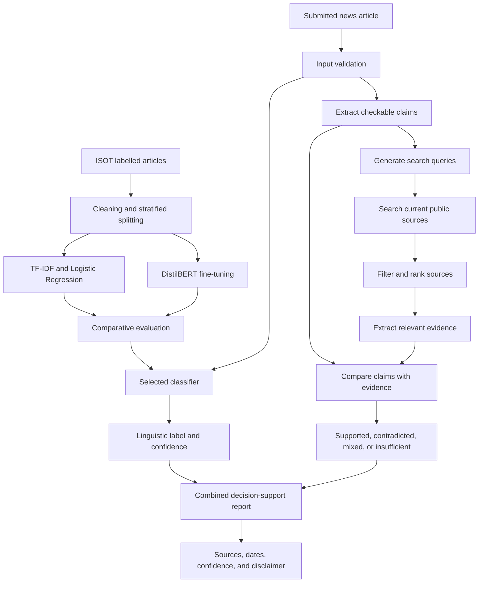

# CHAPTER TWO

# LITERATURE REVIEW

This chapter places the study within existing research on automated fake-news detection and evidence-based claim verification. It begins with the meaning of fake news and the different kinds of information a detection system can use. It then considers supervised text classification, TF-IDF, Logistic Regression, transformer models, benchmark datasets, web evidence retrieval, evaluation, Nigerian misinformation research, and responsible deployment. These topics belong in the same discussion because a useful detection system involves more than choosing an algorithm. The data must be prepared carefully, the models must be compared fairly, relevant current evidence must be retrieved, and the result must be communicated without hiding its uncertainty.

## 2.1 Background Concept

The study begins by analysing the words contained in a news article and then extends that analysis with external evidence. Online reports now move between news sites, search engines, social networks, and messaging applications with very little delay. The same channels that widen access to news can also carry fabricated stories to a large audience. Shu et al. (2017) treat detection as a data-mining problem that can draw on both news content and the social activity surrounding it. From an NLP perspective, Oshikawa, Qian, and Wang (2020) describe the task as difficult and distinguish it from related work on rumours, stance, and fact-checking.

The language used to describe the problem matters. Misinformation may be false even when the person sharing it does not intend to mislead anyone. Disinformation, by contrast, is generally associated with deliberate deception. Fake news usually takes the form of a news report but contains fabricated or seriously misleading information. In practice, these categories overlap, and a simple dataset label cannot capture every question of intention, credibility, or factual accuracy. The system developed in this study makes a narrower judgement: it estimates whether an article resembles the real or fake examples on which it was trained. It does not establish whether each claim in the article is true.

Researchers have approached the task with different kinds of information. Content-based methods examine the language or structure of a report. Social-context methods consider who shared it, how it spread, and how other users responded. Knowledge-based methods compare claims with external evidence, while multimodal methods combine text with images, audio, or video. The present study begins with article text but does not rely on linguistic patterns alone. It also extracts checkable claims and searches public online sources for recent evidence that may support or contradict them.

Text is usually easy to obtain and can be processed consistently, which makes content classification practical. Still, language is only indirect evidence of truth. A model may learn the style of a particular publisher, the names linked to a recurring topic, or even the formatting of the dataset. It can therefore reach the correct label for the wrong reason. Evidence retrieval addresses part of this weakness by connecting claims to information outside the training data. It introduces its own risks, however: search engines may omit useful pages, rank unreliable material highly, return duplicated reporting, or provide evidence that is too old or too recent for the claim.

Evidence-based verification is normally organised as a sequence of tasks. A complex article is first reduced to a manageable set of checkable claims. Search queries are then produced for each claim, relevant documents and passages are retrieved, and the evidence is compared with the claim. Thorne et al. (2018) formalised this pattern in FEVER through document retrieval, evidence selection, and claim classification. More recent work has moved beyond fixed collections toward real-world web evidence. AVeriTeC, for example, evaluates systems on both the correctness of their verdict and the quality of the evidence they retrieve (Schlichtkrull et al., 2023, 2024).

The proposed system examines two families of text representation. The classical branch converts documents into sparse TF-IDF vectors. TF-IDF gives greater weight to terms that are frequent within a document but less frequent across the corpus. Unigrams and bigrams can represent individual words and short sequences, after which Logistic Regression learns a weighted decision boundary between the two classes. This branch provides a computationally efficient and comparatively interpretable baseline.

The transformer branch uses DistilBERT. Unlike a bag-of-words representation, a transformer encodes tokens in context using self-attention. Its representation of a word can therefore vary according to surrounding language. DistilBERT is pretrained on large-scale text and then fine-tuned for the binary classification task. Knowledge distillation makes it smaller and faster than the original BERT model while preserving much of BERT's language capability (Sanh et al., 2019).

This comparison is not only about which model records the highest score. DistilBERT may capture context that the classical model misses, but Logistic Regression may train faster, respond more quickly, occupy less storage, and run comfortably on a CPU. A sensible deployment decision must weigh these practical costs against predictive performance and the kinds of errors each model makes.

Figure 2.1 presents the conceptual framework for the proposed system.

**Figure 2.1: Conceptual Framework for Automated Fake-News Detection Using NLP**

The upper part of the framework represents offline model development. The classical and transformer models are trained and compared on the same prepared data, with validation used for model configuration and a held-out test set used for the final evaluation. The selected classifier is then made available to the online system.

The lower part represents analysis at the time a user submits an article. One path produces a linguistic label and confidence score. The other extracts checkable claims, searches current public sources, ranks the results, and compares relevant passages with the claims. The final report keeps these findings distinguishable while presenting them together. It includes source links and dates and permits a result of insufficient evidence when the search does not provide a sound basis for a conclusion.

The framework also separates stable model training from time-sensitive retrieval. Training may require the complete dataset, repeated experiments, and GPU resources. Evidence retrieval takes place during analysis so that recently published information can be considered. Because current does not always mean credible, the retrieval stage must record dates, prefer authoritative and independent sources, identify duplicated reporting, and avoid treating search rank as evidence quality.

## 2.2 Theoretical Framework

Four ideas guide the study: supervised learning, statistical text representation, transfer learning, and responsible decision support. They explain where the models learn their patterns, why the classical and transformer approaches behave differently, how the comparison should be carried out, and why the final prediction still requires human judgement.

### 2.2.1 Supervised Machine Learning Theory

Supervised learning uses labelled examples to learn a mapping from inputs to outputs. In this study, each input is a news article and each output is a binary label. The training set is used to estimate model parameters, the validation set supports model and hyperparameter decisions, and the held-out test set estimates performance on unseen examples. Stratification helps preserve the class distribution across these subsets.

What the model learns is a statistical relationship between text and the labels in the dataset. It does not learn a complete account of what is true in the world. Its performance depends on the quality of those labels, the representativeness of the articles, the absence of leakage, and the similarity of later inputs to the training data. This is why the system uses cautious language and why domain shift is treated as a serious limitation.

Generalisation is central to the study. A model that memorises training articles may achieve very low training error but perform poorly on unseen data. Duplicate removal, a held-out test set, regularisation, and error analysis are therefore part of the research design. The comparison between a simpler linear classifier and a more expressive transformer also reflects the bias-complexity trade-off: greater model capacity may capture useful context, but it may also increase computational cost and sensitivity to dataset artefacts.

### 2.2.2 Statistical Language Representation

Classical text classification commonly represents a document as a vector of term statistics. TF-IDF combines term frequency with inverse document frequency so that common, low-information words receive less influence than terms that better distinguish documents. N-grams extend the representation from individual words to short local sequences.

Ahmed et al. (2017) used n-gram analysis and machine-learning techniques for online fake-news detection, while Ahmed et al. (2018) further demonstrated text classification for fake news and opinion spam. These works support the use of lexical patterns as a practical baseline. Logistic Regression is particularly appropriate because it works well with high-dimensional sparse input, supports regularisation, and can estimate class probabilities. Its feature weights can also be inspected to determine which terms influence predictions, although those weights must not be interpreted as universal evidence of deception.

The weakness of this representation is that it sees language mainly through counts and short sequences. Two sentences can express the same idea with different words, and the same word can mean different things in different settings. Longer relationships within an article are also difficult to represent with short n-grams. The transformer branch is included to examine whether contextual representations handle these cases better.

### 2.2.3 Transfer Learning and Transformer Theory

Transformer models use attention mechanisms to represent relationships among tokens. BERT pretrains deep bidirectional language representations and can be adapted to downstream NLP tasks with a task-specific output layer (Devlin et al., 2019). Instead of learning language representation entirely from the fake-news dataset, fine-tuning begins with knowledge obtained during large-scale pretraining.

DistilBERT applies knowledge distillation during pretraining. Sanh et al. (2019) report a smaller model that retains much of BERT's language-understanding performance while reducing size and increasing speed. This makes DistilBERT a reasonable choice for the study because the proposed approach requires contextual modelling but must also consider deployment cost.

Fine-tuning adapts the pretrained encoder and classification head to the labelled articles. Tokenisation, truncation, padding, attention masks, optimisation settings, random seeds, and checkpoint selection all influence the experiment. Long articles present a particular challenge because transformer models accept a limited token sequence. Truncation may discard relevant information, while chunking increases complexity. The study must record the selected strategy and treat it as a limitation during evaluation.

### 2.2.4 Evaluation and Decision-Support Theory

Binary classification performance can be viewed through true positives, true negatives, false positives, and false negatives. Accuracy measures the overall proportion of correct predictions, but it can be insufficient where class distribution or error costs differ. Precision describes how often a predicted class is correct, recall describes how much of an actual class is found, and F1-score balances precision and recall. A confusion matrix makes the error distribution visible.

For the proposed system, false positives and false negatives have different practical meanings. Incorrectly labelling a credible article as likely fake may damage trust or reputation. Incorrectly labelling fabricated content as likely real may encourage unwarranted confidence. This asymmetry supports the use of per-class measures and representative error analysis rather than a single aggregate score.

The output is best understood as an aid to judgement. A confidence score shows how strongly the model favours one class under the patterns it has learned; it is not a measure of objective truth. Any decision with serious consequences still requires a person to examine the article and its evidence. This principle shapes the wording of the result, the disclaimer, and the decision not to use the prediction as an automatic basis for censorship.

### 2.2.5 Information Retrieval and Evidence-Based Verification

Information retrieval concerns the selection and ranking of documents that are relevant to a user's information need. In automated fact-checking, the information need is derived from a claim. The system must formulate a useful query, retrieve candidate documents, find the passages that bear directly on the claim, and determine whether those passages support or contradict it. A failure at any early stage can affect the final verdict even when the verification model itself is capable.

FEVER established a widely used three-part pipeline consisting of document retrieval, sentence selection, and claim verification (Thorne et al., 2018). AVeriTeC extends this idea to naturally occurring claims and web evidence. Its evaluation requires both an appropriate verdict and evidence of sufficient quality, reflecting the principle that a conclusion should be traceable to its sources (Schlichtkrull et al., 2024).

Time introduces another dimension. A source published after a claim may be useful when analysing the claim today, but it would be inappropriate in an experiment that asks what evidence was available when the claim first appeared. Chen et al. (2024) address this issue by restricting retrieval to documents available before a claim was made when modelling emerging-claim verification. In the present system, the purpose is current assessment, so later evidence may be retrieved, but publication and retrieval dates must be displayed so that the user can understand the temporal relationship.

Source quality cannot be reduced to recency or search position. Primary documents, official statistics, court records, scientific publications, established news reporting, and professional fact-checks may serve different evidential roles. The system should prefer sources with clear authorship, dates, provenance, and direct relevance, seek more than one independent source where possible, and return insufficient or mixed evidence instead of forcing a binary conclusion.

## 2.3 Related Works

### 2.3.1 Fake News as an NLP and Data-Mining Problem

Shu et al. (2017) organised fake-news detection around news content and social context, explaining that deceptive content may be difficult to identify from text alone and that user engagement can add useful signals. Their work provides a broad framework for understanding the task. The present study adopts only the content component, which makes the system easier to use independently of a social platform but limits the evidence available to the model.

Oshikawa et al. (2020) reviewed NLP formulations, datasets, and methods for fake-news detection and emphasised the task's practical value and difficulty. They also highlighted the need for fairer, more detailed, and more practical detection models. This supports the present study's attention to clearly defined labels, shared evaluation, error analysis, and responsible presentation.

Zhou and Zafarani (2020) surveyed fundamental theories and detection methods and described the multidisciplinary nature of fake-news research. Their review shows that detection can involve style, knowledge, propagation, and source information. The present system does not claim to cover all these dimensions; it investigates a defined text-classification approach within a deployable architecture.

### 2.3.2 Classical Machine-Learning Approaches

Ahmed et al. (2017) investigated online fake-news detection using n-gram features and machine-learning algorithms. Their results demonstrated that lexical representations can identify useful differences between labelled fake and real articles. Ahmed et al. (2018) extended this direction through text classification for fake news and opinion spam. These studies are directly relevant because the ISOT dataset and the classical approach adopted in this study are associated with this line of work.

Classical approaches commonly combine bag-of-words or TF-IDF features with Naive Bayes, Logistic Regression, Support Vector Machines, Random Forests, or related classifiers. Their major strengths are training efficiency, relatively small artifacts, fast inference, and interpretable feature weights. Their weaknesses include limited context and dependence on observed vocabulary. This study selects Logistic Regression as the primary baseline and retains Linear SVM as an optional benchmark rather than evaluating many algorithms without a clear comparative purpose.

### 2.3.3 Benchmark Datasets

The quality and form of a dataset determine what a model can learn. Wang (2017) introduced LIAR, a benchmark of approximately 12,800 manually labelled short political statements collected from PolitiFact. LIAR supports claim-level and fine-grained truthfulness research, but its short statements differ from the article-level classification workflow adopted in this study.

The ISOT Fake News Dataset contains 21,417 real-news articles and 23,481 fake-news articles. The real articles were obtained from Reuters, while the fake articles came from sources identified as unreliable; much of the material concerns politics and world news from 2016 and 2017. Its `True.csv` and `Fake.csv` files include title, text, subject, and date fields. The dataset was introduced and evaluated in the text-classification work of Ahmed et al. (2017, 2018).

ISOT is suitable for article-level experiments and offers enough examples for both a classical model and transformer fine-tuning. However, its source composition creates an important risk. A random split may reward a model for learning Reuters style, topic distributions, or source-specific artefacts rather than broadly generalisable truthfulness cues. The age and geographic focus of the data also limit its relevance to current and Nigerian news. These characteristics require careful interpretation of any high held-out score.

### 2.3.4 Transformer-Based Detection

The publication of BERT shifted many NLP tasks toward pretrained contextual encoders. Devlin et al. (2019) showed that one pretrained bidirectional representation could be fine-tuned for varied downstream tasks without extensive task-specific architecture. Fake-news researchers subsequently applied BERT-family models to text classification because contextual embeddings can represent relationships that sparse lexical features miss.

Kaliyar, Goswami, and Narang (2021) proposed FakeBERT, combining BERT-based representations with a neural classification architecture for fake-news detection. The work illustrates the use of pretrained contextual language models in this domain. Such approaches may improve predictive performance, but they also increase training cost, model size, latency, and the difficulty of explaining individual predictions.

DistilBERT offers a compromise between contextual modelling and efficiency. Sanh et al. (2019) designed it to be smaller and faster than BERT through knowledge distillation. This study uses DistilBERT rather than a larger transformer so that the comparison reflects a realistic model that could later be deployed under constrained resources.

### 2.3.5 Comparative Evaluation of Classical and Deep Models

Recent surveys show that fake-news detection research includes traditional machine learning, deep neural networks, transformers, social-context models, knowledge-based systems, and multimodal approaches (Alghamdi, Luo, & Lin, 2024). Comparisons across papers are difficult because studies often use different datasets, preprocessing rules, splits, metrics, and label definitions. A higher score reported in one paper may therefore not show that its model is better than a model evaluated elsewhere.

The proposed methodology addresses this comparability problem by training the classical and transformer branches on the same prepared dataset and evaluating them through a shared framework. Model selection considers F1-score, class-wise recall, confusion matrices, error examples, latency, artifact size, and deployment hardware. Actual results remain unreported until the experiments are executed; the study does not insert estimated or fabricated metrics.

### 2.3.6 Fake News and Misinformation in Nigeria

The Nigerian context demonstrates why misinformation tools and media literacy matter, while also showing the need for locally representative data. Ahmed and Msughter (2022) studied COVID-19 fake news among social-media users in Kano State and found substantial awareness and exposure, with respondents associating misinformation with non-adherence to safety measures. Their work concerns user behaviour rather than automated classification, but it shows that misinformation can have consequences beyond online discussion.

The Kano study also illustrates a wider point: misinformation is not only a computational problem. Trust in institutions, media habits, and the conditions under which people receive information all affect what they believe and share. A classifier may assist a reader, but it cannot resolve those social questions on its own.

The primary dataset used in this study is not Nigerian. The system may therefore perform differently on Nigerian names, locations, political topics, journalistic conventions, code-switching, Pidgin English, or locally circulated reports. The present study provides an engineering and experimental foundation, while a locally curated and ethically labelled Nigerian news dataset remains an important direction for future work.

### 2.3.7 Evidence Retrieval from Current Sources

Thorne et al. (2018) introduced FEVER, a large benchmark in which claims are labelled as supported, refuted, or not enough information and are accompanied by evidence sentences. The work demonstrated that retrieving the correct evidence is itself a substantial part of the verification problem. However, FEVER uses a fixed Wikipedia collection and artificially constructed claims, so it does not fully reproduce open-web fact-checking.

Augenstein et al. (2019) introduced MultiFC using naturally occurring claims collected from 26 fact-checking organisations, together with textual sources and metadata. Their results showed that representing evidence improves veracity prediction. This supports the move from classifying an isolated claim toward analysing the relationship between a claim and supporting material.

AVeriTeC was designed for real-world claim verification with evidence from the web. The dataset contains 4,568 claims drawn from fact-checks by 50 organisations, with question-answer pairs, online evidence, justifications, and verdicts (Schlichtkrull et al., 2023). The subsequent shared task allowed evidence to be obtained through search engines or a supplied knowledge store and evaluated the verdict only when the evidence reached a quality threshold (Schlichtkrull et al., 2024). This is closely aligned with the proposed extension because it treats retrieval quality and verdict quality as connected requirements.

Chen et al. (2024) presented a realistic pipeline for complex claims that includes claim decomposition, raw web-document retrieval, fine-grained evidence retrieval, claim-focused summarisation, and veracity judgement. Their work shows why a full article should not be converted directly into one broad search query: complex content often needs to be divided into smaller claims before useful evidence can be found.

These studies also expose limitations. Relevant pages may be absent, inaccessible, duplicated, or ranked poorly. Sources may repeat one another without being independent, and a recent page may still be inaccurate. The proposed system therefore treats retrieved material as evidence candidates, records provenance and dates, and allows mixed or insufficient findings.

### 2.3.8 Deployment, Transparency, and Responsible Use

Many studies end with offline metrics, but a usable detection system requires additional engineering. The preprocessing used during training must match production inference. The API must reject empty, malformed, overly short, or oversized input. Model artifacts require metadata and versions. Search timeouts, unavailable pages, conflicting evidence, and unsupported claims require explicit handling. The interface must explain predictions without overstating them and must link evidence summaries back to their sources.

The implementation addresses this layer through a web service, validated request and response schemas, a production model loader, a search and evidence service, structured response fields, a responsive client interface, automated tests, and documentation. The user receives the predicted label, confidence, evidence status, source title, URL, publication date where available, retrieval time, model identity, processing time, and disclaimer. This makes the result more traceable, although a list of sources does not by itself guarantee that the interpretation is correct.

Responsible deployment also requires limits on use. Text-only classification should not automatically remove content, punish authors, determine legal liability, or replace professional fact-checking. Important claims must be evaluated against evidence. Privacy and security controls should minimise unnecessary retention of submitted text, restrict cross-origin access, validate request sizes, protect model files, and keep secrets outside source control.

## 2.4 Summary of Literature Review

The reviewed literature establishes fake-news detection as a significant but difficult NLP and data-mining task. Content-based models can analyse lexical, stylistic, and semantic features, while broader approaches may add social context, source information, external knowledge, or multiple media types. This study uses article text as its input and combines content classification with current web evidence. It does not analyse social propagation or non-textual media, and retrieved sources still require careful interpretation.

Classical research shows that n-gram and TF-IDF representations can support effective fake-news classification. Logistic Regression provides an efficient and interpretable baseline for sparse features. Transformer research shows that pretrained contextual language representations can be fine-tuned for classification, and DistilBERT offers a lighter alternative to BERT. The literature therefore supports comparing these approaches under the same experimental conditions.

Dataset studies show that benchmark choice matters. LIAR is oriented toward short political claims, whereas ISOT contains full articles and better matches the article-level input selected for classification. At the same time, ISOT's source, topic, time-period, and geographic characteristics can lead to bias and domain shift. Evidence-retrieval research adds another lesson: a correct verdict without relevant evidence is not sufficient. Evaluation must therefore cover classification metrics, evidence relevance, claim coverage, source diversity, retrieval failures, latency, and reproducible records.

Nigerian studies confirm the practical importance of misinformation but do not make a globally trained classifier locally valid. Current-source retrieval can provide locally relevant evidence that is absent from ISOT, but it does not remove the need for a Nigerian evaluation dataset. The reviewed deployment concerns further show that an experimental score must be accompanied by reliable preprocessing, model versioning, retrieval safeguards, source provenance, API validation, testing, security, and responsible-use communication.

## 2.5 Research Gap

The reviewed studies provide important work on fake-news concepts, benchmark datasets, classical classifiers, deep learning, transformers, and misinformation behaviour. However, several gaps remain relevant to the present study.

Several gaps emerge from the reviewed work. Some studies examine only one family of models, while others compare scores produced from different datasets and preprocessing choices. Those results do not reveal, under controlled conditions, what is gained or lost when a lightweight TF-IDF model is replaced by a contextual transformer. Text-only classification also cannot respond adequately to new claims that were not represented in historical training data. Evidence-based systems address this problem, but many are evaluated on fixed knowledge stores rather than current public sources. Accuracy is often given more attention than evidence relevance, source quality, class-specific errors, latency, model size, reproducibility, and deployment cost. In addition, many prototypes end as notebooks or scripts without addressing source provenance, retrieval failure, versioned model artifacts, input validation, a usable interface, automated testing, or responsible presentation. A final concern is local relevance: ISOT is useful for benchmarking, but it does not represent contemporary Nigerian journalism.

To address these gaps, the study compares TF-IDF with Logistic Regression against a fine-tuned DistilBERT model using one prepared ISOT pipeline. The selected classifier is combined with claim extraction and current web retrieval so that recent evidence can be considered alongside linguistic patterns. Retrieved pages are ranked for relevance and source quality, important passages are compared with the claims, and the report includes URLs, dates, and an explicit insufficient-evidence outcome. Classification and retrieval are evaluated separately as well as within the end-to-end workflow. Predictions are presented as **Likely Real** or **Likely Fake**, while the evidence component reports **Supported**, **Contradicted**, **Mixed**, or **Insufficient Evidence**. Locally representative Nigerian training and evaluation data, non-textual verification, multilingual support, and long-term production monitoring remain future work.

## REFERENCES

Ahmed, H., Traore, I., & Saad, S. (2017). Detection of online fake news using n-gram analysis and machine learning techniques. In I. Traore, I. Woungang, & A. Awad (Eds.), *Intelligent, secure, and dependable systems in distributed and cloud environments* (Lecture Notes in Computer Science, Vol. 10618, pp. 127–138). Springer. https://doi.org/10.1007/978-3-319-69155-8_9

Ahmed, H., Traore, I., & Saad, S. (2018). Detecting opinion spams and fake news using text classification. *Security and Privacy, 1*(1), e9. https://doi.org/10.1002/spy2.9

Ahmed, M. O., & Msughter, A. E. (2022). Assessment of the spread of fake news of COVID-19 amongst social media users in Kano State, Nigeria. *Computers in Human Behavior Reports, 6*, 100189. https://doi.org/10.1016/j.chbr.2022.100189

Alghamdi, J., Luo, S., & Lin, Y. (2024). A comprehensive survey on machine learning approaches for fake news detection. *Multimedia Tools and Applications, 83*, 51009–51067. https://doi.org/10.1007/s11042-023-17470-8

Augenstein, I., Lioma, C., Wang, D., Chaves Lima, L., Hansen, C., Hansen, C., & Simonsen, J. G. (2019). MultiFC: A real-world multi-domain dataset for evidence-based fact checking of claims. In *Proceedings of the 2019 Conference on Empirical Methods in Natural Language Processing and the 9th International Joint Conference on Natural Language Processing* (pp. 4685–4697). Association for Computational Linguistics. https://doi.org/10.18653/v1/D19-1475

Chen, J., Kim, G., Sriram, A., Durrett, G., & Choi, E. (2024). Complex claim verification with evidence retrieved in the wild. In *Proceedings of the 2024 Conference of the North American Chapter of the Association for Computational Linguistics: Human Language Technologies* (pp. 3569–3587). Association for Computational Linguistics. https://doi.org/10.18653/v1/2024.naacl-long.196

Devlin, J., Chang, M.-W., Lee, K., & Toutanova, K. (2019). BERT: Pre-training of deep bidirectional transformers for language understanding. In *Proceedings of the 2019 Conference of the North American Chapter of the Association for Computational Linguistics: Human Language Technologies* (pp. 4171–4186). Association for Computational Linguistics. https://doi.org/10.18653/v1/N19-1423

Kaliyar, R. K., Goswami, A., & Narang, P. (2021). FakeBERT: Fake news detection in social media with a BERT-based deep learning approach. *Multimedia Tools and Applications, 80*, 11765–11788. https://doi.org/10.1007/s11042-020-10183-2

Oshikawa, R., Qian, J., & Wang, W. Y. (2020). A survey on natural language processing for fake news detection. In *Proceedings of the Twelfth Language Resources and Evaluation Conference* (pp. 6086–6093). European Language Resources Association. https://aclanthology.org/2020.lrec-1.747/

Sanh, V., Debut, L., Chaumond, J., & Wolf, T. (2019). DistilBERT, a distilled version of BERT: Smaller, faster, cheaper and lighter. *arXiv preprint arXiv:1910.01108*. https://doi.org/10.48550/arXiv.1910.01108

Schlichtkrull, M., Guo, Z., & Vlachos, A. (2023). AVeriTeC: A dataset for real-world claim verification with evidence from the web. In *Advances in Neural Information Processing Systems 36: Datasets and Benchmarks Track*. https://papers.nips.cc/paper_files/paper/2023/hash/cd86a30526cd1aff61d6f89f107634e4-Abstract-Datasets_and_Benchmarks.html

Schlichtkrull, M., Chen, Y., Whitehouse, C., Deng, Z., Akhtar, M., Aly, R., Guo, Z., Christodoulopoulos, C., Cocarascu, O., Mittal, A., Thorne, J., & Vlachos, A. (2024). The Automated Verification of Textual Claims (AVeriTeC) shared task. In *Proceedings of the Seventh Fact Extraction and VERification Workshop* (pp. 1–26). Association for Computational Linguistics. https://doi.org/10.18653/v1/2024.fever-1.1

Shu, K., Sliva, A., Wang, S., Tang, J., & Liu, H. (2017). Fake news detection on social media: A data mining perspective. *ACM SIGKDD Explorations Newsletter, 19*(1), 22–36. https://doi.org/10.1145/3137597.3137600

Thorne, J., Vlachos, A., Christodoulopoulos, C., & Mittal, A. (2018). FEVER: A large-scale dataset for fact extraction and verification. In *Proceedings of the 2018 Conference of the North American Chapter of the Association for Computational Linguistics: Human Language Technologies* (pp. 809–819). Association for Computational Linguistics. https://doi.org/10.18653/v1/N18-1074

Wang, W. Y. (2017). “Liar, liar pants on fire”: A new benchmark dataset for fake news detection. In *Proceedings of the 55th Annual Meeting of the Association for Computational Linguistics (Volume 2: Short Papers)* (pp. 422–426). Association for Computational Linguistics. https://doi.org/10.18653/v1/P17-2067

Zhou, X., & Zafarani, R. (2020). A survey of fake news: Fundamental theories, detection methods, and opportunities. *ACM Computing Surveys, 53*(5), Article 109. https://doi.org/10.1145/3395046
